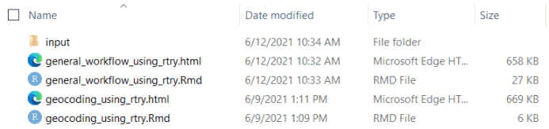
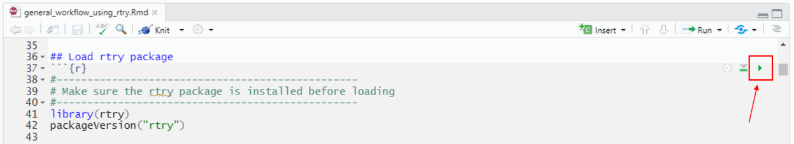

```{r, include = FALSE}
knitr::opts_chunk$set(
  collapse = TRUE,
  comment = "#>"
)
```


***


# The TRY database

The TRY database (https://www.try-db.org) is a Plant Trait Database operated since 2007 with the incentive to improve the availability and accessibility of plant trait data for ecology and earth system sciences. Since then, the TRY database has grown continuously and is now providing unprecedented data coverage under an open access data policy for research community worldwide.

In 2014, the TRY database was made publicly available through the implementation of the TRY Data Portal (https://www.try-db.org/TryWeb/dp.php). This Portal organizes data uploads, searches and requests, and enables interaction between data contributors, management and users. At the same time, it provides a link to the TRY File Archive (https://www.try-db.org/TryWeb/Data.php), which offers climate and soil data for TRY measurement sites, standardized categorical traits relevant to attribute species to plant functional types (PFTs), and provides the opportunity to publish plant trait data sets and receive a DOI. (For details related data request, please refer to the 'Request data from the TRY database' section below.)

The TRY database version 5 released on 26 March 2019, contained 387 data sets providing 11.8 million trait records, accompanied by 35 million ancillary data, for 2091 traits and 280000 plant taxa, mostly at the species level. Our team at the Max Planck Institute for Biogeochemistry (MPI-BGC) is currently working towards the release of version 6.

<br>

## Column headers

Through the TRY Data Portal, the trait data is provided as zipped text file (`.txt`) with `Latin-1` encoding. In version 5, there are 27 tab-delimited columns in the provided data, which is indicated as header in the first row of the text file.


|      | Column         | Comment                                                      |
| ---- | -------------- | ------------------------------------------------------------ |
| 1.   | LastName       | Surname of data contributor                                  |
| 2.   | FirstName      | First name of data contributor                               |
| 3.   | DatasetID      | Unique identifier of contributed dataset                     |
| 4.   | Dataset        | Name of contributed dataset                                  |
| 5.   | SpeciesName    | Original name of species                                     |
| 6.   | AccSpeciesID   | Unique identifier of consolidated species name               |
| 7.   | AccSpeciesName | Consolidated species name                                    |
| 8.   | ObservationID  | Unique identifier for each observation                       |
| 9.   | ObsDataID      | Unique identifier for each record                            |
| 10.  | TraitID        | Unique identifier for traits (only if the record is a trait) |
| 11.  | TraitName             | Name of trait (only if the record is a trait)                |
| 12.  | DataID                | Unique identifier for each sub-trait or context information  |
| 13.  | DataName              | Name of sub-trait or context information                     |
| 14.  | OriglName             | Original name of sub-trait or context information            |
| 15.  | OrigValueStr          | Original value as text string                                |
| 16.  | OrigUnitStr           | Original unit as text string                                 |
| 17.  | ValueKindName         | Value kind (single measurement, mean, median, etc.)          |
| 18.  | OrigUncertaintyStr    | Original uncertainty as text string                          |
| 19.  | UncertaintyName       | Kind of uncertainty (standard deviation, standard error, etc.) |
| 20.  | Replicates            | Count of replicates                                          |
| 21.  | StdValue              | Standardized value: available for standardized traits        |
| 22.  | UnitName              | Standard unit: available for standardized traits             |
| 23.  | RelUncertaintyPercent | Relative uncertainty in %                                    |
| 24.  | OrigObsDataID         | Unique identifier for duplicate entries                      |
| 25.  | ErrorRisk             | Indication for outliers: distance to mean in standard deviations |
| 26.  | Reference             | Reference to be cited if trait record is used in analysis    |
| 27.  | Comment               | Explanation for the `OriglName` in the contributed dataset |

Note that sometimes R may show a column 28, which should be empty. This column is an artefact due to the different software (MySQL >> R).

<br>

## The TRY R Project

Due to the unique long table structure, the TRY data must be pre-processed in a way such that it is easy to handle and understand before analysis. The `rtry` package for `R` provides a set of functions to facilitate the pre-process the TRY data, that allows users who are not familiar with the `R` programming language or the TRY dataset structure to easily prepare the data for further analysis.

This project is an open-source project that can be found on the MPI-BGC-Functional-Biogeography GitHub repository: https://github.com/MPI-BGC-Functional-Biogeography/rtry

Users can also choose to obtain the source package and relative documentation from the Nextcloud operated by MPI-BGC. 

- Link: https://nextcloud.bgc-jena.mpg.de/s/RMd5kqg7tRWXpae
- Password: `mpi-bgc-rtry`


### R environment

R 4.0.3 was used to develop and build the `rtry` package, and this is the minimum version required to use the package. It is also recommended to use the latest version of RStudio when using the package.

The latest version of R can be downloaded from CRAN, a network of ftp and web servers around the world that store the code and documentation of R: https://cran.r-project.org/

The released version of RStudio, an integrated development environment (IDE) designed for productive R programming, can be found at https://www.rstudio.com/products/rstudio/download/, it is sufficient to use the free and open source version of RStudio Desktop.


### Try out example workflow

To assist first-time user, several example workflows have been developed and are provided in different formats:

- vignettes, that comes along with the `rtry` package without additional download, acts as a guideline for users to follow
- R Markdown scripts (`.Rmd`) and HTML files (`.html`), located inside the `examples` directory can be downloaded from the link provided at the beginning of this Section, allows users to run the example scripts directly and compare the expected results in the browser

The required sample data is also provided within the package and inside the `examples/input` directory. In order to run the code smoothly, make sure the script is place inside a folder in which the sample data is saved inside the `input` folder. This can be done manually or achieved simply by downloading the entire `examples` directory.

{width=70%}


To try out the example workflow, open the `.Rmd` (e.g. `general_workflow_using_rtry.Rmd`) by double clicking the file, this will prompt the RStudio to open. Then, make sure the work directory is set to the location where the directory is located:

```R
setwd("<path_to_rtry_examples_dir>")
```

Once the script (`.Rmd`) is opened, you will be able to see that the source code had been divided into different chunks (i.e. the grey blocks) with descriptions and comments explaining each step.

To execute the code in a particular chunk, simply press the corresponding green arrow on the top right of that chunk, or place your cursor within that chunk then press `Ctrl+Shift+Enter`. This way only the code included within the chunk is executed, and users can easily modify and re-execute different steps.

Also, the output or feedback of the executed code will be displayed directly below the chunk, allowing easy trace back.

{width=90%}

Note: The expected results could be viewed in the corresponding `.html` file.

<br>

---

# The `rtry` package

Inside the `rtry` package, we use a function naming convention where each function begins with the prefix `rtry_` followed by what the specific function does. **[Refer to reference manual or ??rtry]**

- `rtry_import`
- `rtry_explore`
- `rtry_bind_col`
- `rtry_bind_row`
- `rtry_merge_col`
- `rtry_merge_row`
- `rtry_select_col`
- `rtry_select_row`
- `rtry_select_aux`
- `rtry_filter`
- `rtry_filter_keyword`
- `rtry_rm_col`
- `rtry_rm_dup`
- `rtry_trans_wider`
- `rtry_export`
- `rtry_geocoding`
- `rtry_revgeocoding`


<br>

## Example workflows using `rtry`

- [The general workflow](rtry-workflow-general.html)
  - An example workflow setup to demonstrate how to use the `rtry` package to pre-process of the data exported from the TRY database
  - Covers most of the `rtry_` functions from importing and exploring to binding multiple data, as well as selecting, filtering specific data and removing duplicates, and finally exporting the pre-process data


- [Perform (reverse) geocoding](rtry-workflow-geocoding.html)
  - An example workflow setup to demonstrate how to use the `rtry` package to perform geocoding and reverse geocoding on the TRY data
  - Covers mainly the `rtry_geocoding()` and `rtry_revgeocoding()` functions


<br>

***

# Data license

The TRY database is open source under a Creative Commons Attribution license (CC BY 4.0, https://creativecommons.org/licenses/by/4.0): anyone can use and redistribute data received via TRY under the only condition of appropriate citation of the TRY database and the references of contributing data sets.

The `rtry` package is also distributed under the CC BY 4.0 license, with a remark that the (reverse) geocoding functions provided within the package used the Nominatim developed with OpenStreetMap. Despite the API and the data provided are free to use for any purpose, including commercial use, note that they are governed by the ODbL (https://wiki.osmfoundation.org/wiki/Licence).

<br>

***

# Authorship guidelines

The standard reference of the TRY database is currently:

Kattge, J., Bönisch, G., Díaz, S., Lavorel, S., Prentice, I. C., Leadley, P., Tautenhahn, S., Werner, G., et al. (2020). TRY plant trait database - enhanced coverage and open access. Global Change Biology, 26(1), 119-188. doi:10.1111/gcb.14904.


> reference for the rtry package
