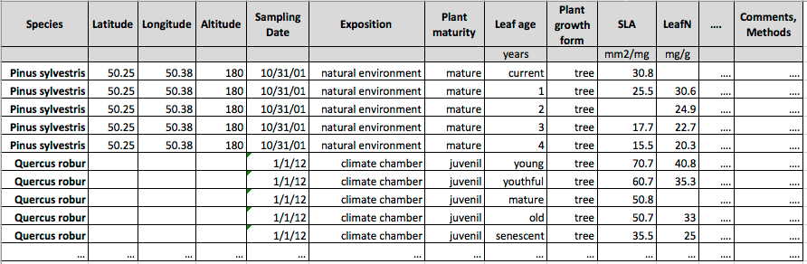

```{r, include = FALSE}
knitr::opts_chunk$set(
  collapse = TRUE,
  comment = "#>"
)
```

------------------------------------------------------------------------

# Overview

'rtry' is an R package to support the application of plant trait data providing easily applicable functions for the basic steps of data preprocessing, e.g. data import, data exploration, selection of columns and rows, excluding trait data according to different attributes, long- to wide-table transformation, data export, and geocoding. The 'rtry' package is designed to support the preprocessing of data released from the TRY Plant Trait Database, but is also applicable for other trait data.

The TRY database ([https://www.try-db.org](https://www.try-db.org/TryWeb/Home.php)) has been designed as an integrated database for all kinds of plant traits (Kattge et al. 2011a, 2020). In addition to the trait values, the TRY database offers rich information to facilitate filtering trait data according to different attributes, e.g. exposition (natural environment, growth chambers, etc.), georeference, or sampling date. However, the size of datasets released from TRY is often too large to be handled by spreadsheets like Microsoft Excel and the relevant information for trait data filtering is contained at different places of the released data, e.g. trait names, species names, ancillary data representing context information, units of trait data, and identifiers for duplicates and outliers. Therefore, finding all relevant information to select or remove trait data is not straightforward without knowledge of the inherent data structure.

Therefore, we developed the 'rtry' package to support data preprocessing, particularly data exploration and removal (filtering), taking advantage of the features of trait data released from the TRY database. The package is supposed to be applicable without advanced knowledge of the data structure released from TRY or the R software.

Additional vignettes providing example workflows for trait data preprocessing and geocoding are available at:

-   [The general workflow (rtry-workflow-general)](rtry-workflow-general.html)

    -   An example workflow setup to demonstrate how to use the 'rtry' package to preprocess the data exported from the TRY database
    -   Covers most of the 'rtry' functions from importing and exploring to binding multiple data frames, as well as selecting or excluding specific data, removing duplicates, converting long-table to wide-table, and finally exporting the preprocessed data

-   [Perform (reverse) geocoding (rtry-workflow-geocoding)](rtry-workflow-geocoding.html)

    -   An example workflow setup to demonstrate how to use the 'rtry' package to perform geocoding and reverse geocoding on a dataset
    -   Covers mainly the functions `rtry_geocoding` and `rtry_revgeocoding`

The 'rtry' package is a product of the TRY R project, which is maintained on the GitHub repository of the Functional Biogeography group at the Max-Planck Institute for Biogeochemistry in Jena: https://github.com/MPI-BGC-Functional-Biogeography/rtry. The project is supposed to support the development of R tools for trait data preprocessing and analysis, starting with tools to preprocess trait data released from the TRY database. Further developments of the package will also be available on this open access GitHub repository.

<br>

------------------------------------------------------------------------

# The TRY data format

The TRY database integrates different datasets into one common structure with harmonized plant species, traits and context information (ancillary data), like latitude and longitude of the sampling site (Kattge et al. 2011b). Most datasets contributed to TRY are in a wide-table format, where all data belonging to one observation are in one row. The different kinds of data, like species names, traits, or ancillary data, are in different columns (see Figure 1).

{width="100%"}


In the context of data integration into TRY, the column headers of traits and ancillary data are first assigned a so-called `DataName` (and `DataID`). In a second step, `DataName`s for traits are combined to `TraitName`s (and `TraitID`s). For the example in Figure 1 the column header "LeafN" (`OriglName`) would first be assigned to `DataID` 15 (Leaf nitrogen content per dry mass (Nmass)), and in a second step to `TraitID` 14 (Leaf nitrogen (N) content per leaf dry mass). In many cases several `DataID`s are combined to one `TraitID`, and the `DataName`s (and `OriglName`s) contain additional information, which may be lost in more generalized `TraitName`s. Finally, the wide-table format is transformed into a long-table format, where each row contains one record - either a trait value or an ancillary data - with some additional information. Each row in the TRY data table has a unique identifier (ID), the `ObsDataID`. The `ObservationID` links the different trait records and ancillary data of an observation.

{width="100%"}

Through the TRY Data Portal (https://www.try-db.org/TryWeb/dp.php), trait data are released in a tab-delimited long-table format as zipped text file (`.txt`) with `Latin-1` encoding.

In TRY version 5, the output long-table has 27 columns, with a header in the first row of the text file (see Table 1). Datasets released from other versions of the TRY database may contain different numbers of columns. However, this is taken into account within the 'rtry' package, as it provides a function for detailed data exploration (`rtry_explore()`, for details please refer to the section "The 'rtry' package" below).

Table 1: Column headers of data released from the TRY version 5

|      | Column    | Comment                                  |
| ---- | --------- | ---------------------------------------- |
| 1.   | LastName  | Surname of data contributor              |
| 2.   | FirstName | First name of data contributor           |
| 3.   | DatasetID | Unique identifier of contributed dataset |
| 4.   | Dataset   | Name of contributed dataset              |
| 5.   | SpeciesName | Original name of species |
| 6.   | AccSpeciesID | Unique identifier of consolidated species name |
| 7.   | AccSpeciesName | Consolidated species name |
| 8.   | ObservationID | Unique identifier for each observation in TRY |
| 9.   | ObsDataID | Unique identifier for each row in the TRY data table, either trait record or ancillary data |
| 10.   | TraitID | Unique identifier for traits (only if the record is a trait) |
| 11.   | TraitName | Name of trait (only if the record is a trait) |
| 12.   | DataID | Unique identifier for each `DataName` (either sub-trait or ancillary data) |
| 13.   | DataName | Name of sub-trait or ancillary data |
| 14.   | OriglName | Original name of sub-trait or ancillary data |
| 15.   | OrigValueStr | Original value of trait or ancillary data |
| 16.   | OrigUnitStr | Original unit of trait or ancillary data |
| 17.   | ValueKindName | Value kind (single measurement, mean, median, etc.) |
| 18.   | OrigUncertaintyStr | Original uncertainty |
| 19.   | UncertaintyName | Kind of uncertainty (standard deviation, standard error, etc.) |
| 20.   | Replicates | Number of replicates |
| 21.   | StdValue | Standardized trait value: available for frequent continuous traits |
| 22.   | UnitName | Standard unit: available for frequent continuous traits |
| 23.   | RelUncertaintyPercent | Relative uncertainty in % |
| 24.   | OrigObsDataID | Unique identifier for duplicate trait records |
| 25.   | ErrorRisk | Indication for outlier trait values: distance to mean in standard deviations |
| 26.   | Reference | Reference to be cited if trait record is used in analysis |
| 27.   | Comment | Explanation for the `OriglName` in the contributed dataset |
| 28.   | V28 | Empty, an artifact due to different interpretation of column separator by MySQL and R |

For more detailed information about data harmonization and integration in the TRY database please check the publications Kattge et al. 2011a, 2011b, 2020, the TRY website (https://www.try-db.org/TryWeb/Database.php) and the Data Release Notes distributed with each data release.

<br>

------------------------------------------------------------------------

# The 'rtry' package

The 'rtry' package provides a set of easily applicable functions to facilitate the preprocessing of plant trait data, e.g. data import, data exploration, selection of columns and rows, excluding trait data according to different attributes, geocoding, long- to wide-table transformation, and data export. The 'rtry' package has been developed with a focus on data released from the TRY database. However, the 'rtry' package is supposed to be applicable without advanced knowledge of the R software and without in-depth knowledge of all aspects of the TRY data structure.

<br>

## Sources of 'rtry'

There are two sources where the users can download the 'rtry' package and the relevant documentation.

**CRAN**

The 'rtry' package is available on the CRAN repository. This is the recommended option to obtain the latest version of the package.

**GitHub Repository**

The MPI-BGC-Functional-Biogeography GitHub repository: https://github.com/MPI-BGC-Functional-Biogeography/rtry.

-   Code: the source code for the released package, as well as the developing functions
-   Wiki: the documentation of the package and the example workflows, as well as some additional information related to the TRY R project
-   Issues: users can use this platform to report bugs or provide feature suggestions

Developers are also welcome to contribute to the package.

<br>

## R environment

R 4.0.5 was used to develop and build the 'rtry' package, and this is the minimum version required to use the package.

The latest version of R can be downloaded from CRAN, a network of ftp and web servers around the world that store the code and documentation of R: https://cran.r-project.org/.

In case RStudio is used, we also recommend to use the latest version of RStudio, which can be found at https://posit.co/download/rstudio-desktop/. It is sufficient to use the free and open-source version of RStudio Desktop.

<br>

## Memory requirement

Since R reads the entire dataset into the memory all at once and because R holds the objects it is using in virtual memory, memory capacity is important when loading large dataset (\>500,000 trait records) released from the TRY database.

When a memory issue occurs, users could either use a machine with more memory (RAM) installed, or they could request multiple smaller datasets (instead of one large dataset) and import the datasets into R separately. It is also possible to use [`memory.limit()`](https://www.rdocumentation.org/packages/utils/versions/3.6.2/topics/memory.size) to increase the default memory, e.g. `memory.limit(size=2500)`, where the size is in MB. Note that you need to be using 64-bit in order to take real advantage of this.

<br>

## Installation guide

The installation of the 'rtry' package can be performed through the RStudio console.

First, install all the dependencies with the command:

```R
install.packages(c("data.table", "dplyr", "tidyr", "jsonlite", "curl"))
```

Once the installation is completed, the message "`The downloaded source packages are in <path>`" should be seen.

Next, install the 'rtry' package with the command:

From CRAN:

```R
install.packages("rtry")
```

Else, if the user downloaded the source package (`.tar.gz`) from the GitHub repository:

```R
install.packages("<path_to_rtry.tar.gz>", repos = NULL, type = "source")
```

Note: The character "`\`" is used as escape character in R to give the following character special meaning (e.g. "`\n`" for newline, "`\t`" for tab, "`\r`" for carriage return and so on). Therefore, for Windows users, it is important to use the "`\`" in the file path of the command instead of "`/`" in order for R to correctly understand the input path.

You may ignore the warning message "`Rtools is required to build R packages but is not currently installed`" if it appears.

Once the installation is completed, the 'rtry' package needs to be loaded with the command:

```R
library(rtry)
```

<br>

## Update the 'rtry' package

To update the 'rtry' package to a newer version in the future, simply restart RStudio and use the same installation command.

From CRAN:

```R
# Remember to restart RStudio first
install.packages("rtry")
```

Else, if the user downloaded the latest source package (`.tar.gz`) of 'rtry' from the GitHub repository:

```R
# Remember to restart RStudio first
install.packages("<path_to_rtry.tar.gz>", repos = NULL, type = "source")
```

You may ignore the warning message "`Rtools is required to build R packages but is not currently installed`" if it appears.

<br>

## R commands to retrieve information about the package

### Check 'rtry' version

To check the version of the loaded 'rtry' package:

```R
packageVersion("rtry")
```

<br>

### Obtain documentations of the 'rtry' package

To get an overview of the 'rtry' package and the corresponding documentations:

```R
help(package = "rtry")
```

This command displays an index of all help pages with the vignettes, functions, and sample datasets of the 'rtry' package on the `Help` panel on RStudio.

<br>

### Obtain documentation for a specific function

Inside the 'rtry' package, each function has its corresponding documentation providing a brief description of the function, and explanation for each argument. For the documentation of a specific function, such as `rtry_import()`, type a `?` in front of the function name:

```R
?rtry_import
```

To view the R code underlying the function, the `View` function can be used within R or RStudio:

```R
View(rtry_import)
```

For the source code with comments, go to your local R directory, then look for the `rtry/R` directory which should be located inside the `library` directory. A `.R` file for each function is provided. Else the source code is also provided on the GitHub repository.

<br>

### Obtain documentation for the sample data

Several sample datasets have been provided within the 'rtry' package, see:

```R
help(package = "rtry")
```

To obtain the documentation of the data such as `data_TRY_15160`, use the following command:

```R
?data_TRY_15160
```

To display the first 6 rows present in the sample data:

```R
head(data_TRY_15160)
```

Another option to view the sample data when using RStudio is the `View` function:

```R
View(data_TRY_15160)
```

For more information about the sample data within the package and how to import them, see the section "Sample datasets within the 'rtry' package" below.


<br>

### Obtain vignettes of the package

To open a list of vignettes for the 'rtry' package:

```R
browseVignettes("rtry")
```

To directly view a vignette (e.g. `rtry-introduction`) of the 'rtry' package from the `Help` panel of RStudio:

```R
vignette("rtry-introduction")
```

<br>

------------------------------------------------------------------------

## Functionality of the 'rtry' package

The 'rtry' package is a compilation of functions developed to support the preprocessing of trait data, foremost if received via the TRY database. To enable easy application, some attributes within the 'rtry' package are specified for the structure or column names used in the data released from TRY.

To realize the full functionality of 'rtry' for other trait datasets, these datasets should be transformed to the data structure used in the data releases from the TRY database: long-table format specifically including the column names of the IDs: `ObservationID`, `ObsDataID`, `TraitID`, `DataID`, `OrigObsDataID`, `AccSpeciesID`, `DatasetID`, and the columns `StdValue`, `OrigValueStr` and `ErrorRisk`. Different measurements (traits and ancillary data) are combined via the `ObservationID`. If additional datasets are used with the TRY data, these need to be consistent with the respective data from TRY.

<br>

### Function default arguments

There are some implicit aspects with respect to writing commands in R that make commands short and convenient. For example, the `rtry_import` function is by default set to fit the data released from TRY, and is specified as:

```R
rtry_import(
  input,
  separator = "\t",
  encoding = "Latin-1",
  quote = "",
  showOverview = TRUE
)
```

The example above is copied from the reference manual and includes the function name and all possible arguments for this function.

If the argument is followed by "`=`", it means a default value is specified. Else it awaits the user input at all times. If an argument is specified by default, it does not need to be explicitly written when calling the function. Therefore, importing a data released from TRY is as simple as:

```R
data <- rtry_import(input_path)
```

However, to import other file formats, the arguments may need to be explicitly defined. For example, to import a data file with comma separated values (`.csv`):

```R
data <- rtry_import(input_path,
          separator = ",",
          encoding = "UTF-8",
          quote = "\"",
          showOverview = TRUE)
```

By explicitly defining the arguments, the default values are overridden.

In R, the order of operations when given a sequence of arguments is:

1.  Check for exact match for a named argument, e.g. `separator`.
2.  Check for a partial match, e.g. `sep`.
3.  Check for a positional match, according to the sequence given in the reference manual. In this case, a user would just specify the values of the arguments without providing the argument name itself, e.g. `data <- rtry_import(input_path, ",", "UTF-8", "\"", TRUE)`.

<br>

### Functions within the 'rtry' package

Inside the 'rtry' package, we use a function naming convention where each function begins with the prefix `rtry_` followed by what the specific function does. The 'rtry' package consists of the following functions:

-   `rtry_import`: Import data
-   `rtry_explore`: Explore data
-   `rtry_bind_col`: Bind data by columns
-   `rtry_bind_row`: Bind data by rows
-   `rtry_join_left`: Left join for two data frames
-   `rtry_join_outer`: Outer join for two data frames
-   `rtry_select_col`: Select columns
-   `rtry_select_row`: Select rows
-   `rtry_select_anc`: Select ancillary data in wide-table format
-   `rtry_exclude`: Exclude data
-   `rtry_remove_col`: Remove columns
-   `rtry_remove_dup`: Remove duplicates in data
-   `rtry_trans_wider`: Transform data from long- to wide-table
-   `rtry_export`: Export preprocessed data
-   `rtry_geocoding`: Perform geocoding
-   `rtry_revgeocoding`: Perform reverse geocoding

Detailed description of each function can be found in the reference manual (`.pdf`), or via the command:

```R
# For the documentation of a specific function (e.g. `rtry_import())
# Type a `?` in front of the function name
?rtry_import

# For the underlying R code, use the `View` function
View(rtry_import)
```

<br>

## Handling of data within 'rtry'

Within 'rtry', data are stored and used as tables (frames) with features fulfilling the requirements of both classes in R: `data.table` and `data.frame`. Functions used for preprocessing can use both formats as input format and they do not change the format for the output. Only the output of the functions `rtry_explore`, `rtry_trans_wider`, `rtry_geocoding` and `rtry_revgeocoding` is of format `data.frame` only.

<br>

## Sample datasets within the 'rtry' package

Several sample datasets are provided within the 'rtry' package, see:

```R
help(package = "rtry")
```

The sample datasets are provided in `.rda` format (a format designed for use with R) and in raw data format (`.txt` or `.csv`).

Detailed description of each dataset can be found via the command:

```R
# For the documentation of a specific dataset
# e.g. `data_TRY_15160` or `data_locations`
# Type a `?` in front of the name of the dataset
?data_TRY_15160
?data_locations

# To view the dataset by invoking the data viewer in RStudio
# Use the `View` function
View(data_TRY_15160)
View(data_locations)
```

To import a dataset (`.rda` format) from the 'rtry' package into the workspace:

```R
TRYdata1 <- data_TRY_15160
locations <- data_locations
```

Note: All 'rtry' sample datasets in `.rda` format are in the package folder `data`.

To access the address of a dataset in its raw data format, the following R command will return the exact path:

```R
# To obtain the exact path of the raw dataset within the package
system.file("testdata", "data_TRY_15160.txt", package = "rtry")
system.file("testdata", "data_locations.csv", package = "rtry")

# Expected return on a Mac OS is similar to this:
## [1] "/Library/Frameworks/R.framework/Versions/4.0/Resources/library/rtry/testdata/data_TRY_15160.txt"
## [1] "/Library/Frameworks/R.framework/Versions/4.0/Resources/library/rtry/testdata/data_locations.csv"

# Expected return on a Windows OS is similar to this:
## [1] "C:/Program Files/R/R-4.0.5/library/rtry/testdata/data_TRY_15160.txt"
## [1] "C:/Program Files/R/R-4.0.5/library/rtry/testdata/data_locations.csv"
```

Note: All 'rtry' sample datasets in their raw data format are in the package folder `testdata`.

This address can be used to import the sample dataset from TRY provided within the 'rtry' package, e.g.:

```R
TRYdata1 <- rtry_import(system.file("testdata", "data_TRY_15160.txt", package = "rtry"))
locations <- rtry_import(system.file("testdata", "data_locations.csv", package = "rtry"),
              separator = ",",
              encoding = "UTF-8",
              quote = "\"")
```

<br>

------------------------------------------------------------------------

# Copyright license

The 'rtry' package is distributed under the [CC BY 4.0](https://github.com/MPI-BGC-Functional-Biogeography/rtry/blob/main/LICENSE.md) license, with a remark that the (reverse) geocoding functions provided within the package used the Nominatim developed with OpenStreetMap. Although the API and the data provided are free to use for any purpose, including commercial use, note that they are governed by the [Open Database License (ODbL)](https://wiki.osmfoundation.org/wiki/Licence).

<br>

------------------------------------------------------------------------

# References

Kattge, J., S. Díaz, S. Lavorel, I. C. Prentice, P. Leadley, G. Bönisch, E. Garnier (2011a). "TRY - a global database of plant traits." <u>Global Change Biology</u> **17**(9): 2905-2935. doi: [10.1111/j.1365-2486.2011.02451.x](https://doi.org/10.1111/j.1365-2486.2011.02451.x)

Kattge, J., K. Ogle, G. Bönisch, S. Díaz, S. Lavorel, J. Madin, K. Nadrowski, S. Nöllert, K. Sartor and C. Wirth (2011b). "A generic structure for plant trait databases." <u>Methods in Ecology and Evolution</u> **2**(2): 202-213. doi: [10.1111/j.2041-210X.2010.00067.x](https://doi.org/10.1111/j.2041-210X.2010.00067.x)

Kattge, J., G. Bönisch, S. Díaz, S. Lavorel, I. C. Prentice, P. Leadley, S. Tautenhahn (2020). "TRY plant trait database -- enhanced coverage and open access." <u>Global Change Biology</u> **26**(1): 119-188. doi: [10.1111/gcb.14904](https://doi.org/10.1111/gcb.14904)
