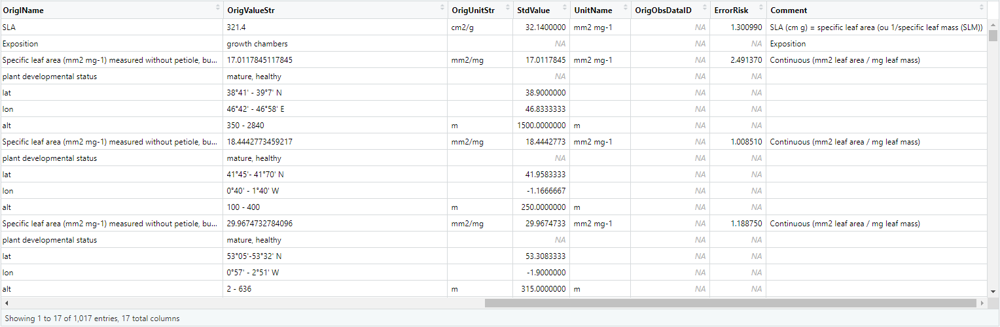
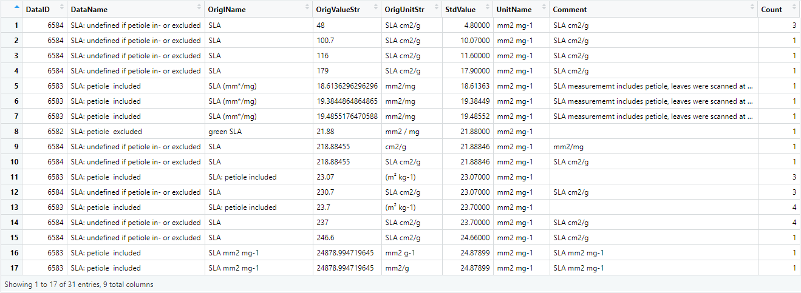
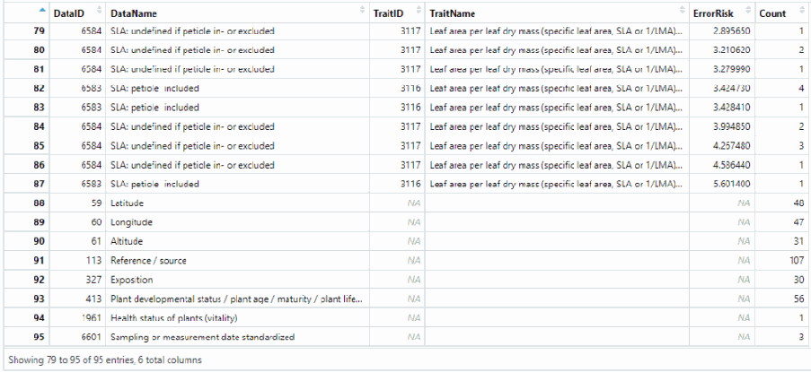

```{r, include = FALSE}
knitr::opts_chunk$set(
  collapse = TRUE,
  comment = "#>"
)
```


***


This vignette is intended to demonstrate how to use the `rtry` package to perform preprocess of the data exported from the TRY database, from importing and exploring the data to binding multiple data, as well as selecting, filtering specific data using user-defined criteria and removing duplicates, and finally exporting the preprocess data.

<br>

# Prepare the workflow environment

Make sure you have the `rtry` package installed. If not, you may refer to the "The TRY R Project" section within the vignette ["Introduction to rtry" (rtry-introduction-new)](rtry-introduction-new.html).

It is also advised to download the `examples` directory from the MPI-BGC Nextcloud in which both the example workflow script and sample data are provided.

To start with, set the work directory to the location where the `examples` directory is located:

```R
setwd("<path_to_rtry_examples_dir>")
```

Note: The character `\` is used as escape character in R to give the following character special meaning (e.g. `\n` for newline, `\t` for tab, `\r` for carriage return and so on). Therefore, for Windows users, it is important to replace the `\` in the file path with `/` in order for R to correctly understand the input path.

Load the required packages using the commands:

```R
library(rtry)	# load the rtry package
packageVersion("rtry")	# check the version of rtry
```

<br>

# Import TRY data

The `rtry_import()` takes five arguments `input`, `separator`, `encoding`, `quote` and `showOverview`, and returns a data table that contains the entire dataset. Since the function by default imports the text file exported from the TRY database for further processing, to import the TRY data (e.g. `TRYdata_15160.txt`), simply type the following:

```R
TRYdata1 <- rtry_import("input/TRYdata_15160.txt")
```

```R
## input: input/TRYdata_15160.txt
## dim:   1782 28 
## col:   LastName FirstName DatasetID Dataset SpeciesName AccSpeciesID AccSpeciesName ObservationID ObsDataID TraitID TraitName DataID DataName OriglName OrigValueStr OrigUnitStr ValueKindName OrigUncertaintyStr UncertaintyName Replicates StdValue UnitName RelUncertaintyPercent OrigObsDataID ErrorRisk Reference Comment V28 
```

Once the data has been imported, there are two ways to view the imported data (in this case `TRYdata1`).

**Method 1: ** Print the first 5 rows of the `TRYdata1` using the command:

```R
head(TRYdata1)
```

**Method 2: ** View the entire `TRYdata1`, use the following command and the data viewer will be prompted:

```R
View(TRYdata1)
```

To import another TRY data:

```R
TRYdata2 <- rtry_import("input/TRYdata_15161.txt")
```

```R
## input: input/TRYdata_15161.txt
## dim:   4627 28 
## col:   LastName FirstName DatasetID Dataset SpeciesName AccSpeciesID AccSpeciesName ObservationID ObsDataID TraitID TraitName DataID DataName OriglName OrigValueStr OrigUnitStr ValueKindName OrigUncertaintyStr UncertaintyName Replicates StdValue UnitName RelUncertaintyPercent OrigObsDataID ErrorRisk Reference Comment V28 
```

Again to view the imported data, use either of the following commands:

```R
head(TRYdata2)
```

```R
View(TRYdata2)
```

<br>

# Explore the imported data

The `rtry_explore()` takes four arguments `input`, `...`, `sortBy` and `showOverview`, and converts the input into a grouped data table based on the specified column names. To provide a first understanding of the data, an additional column is added to show the total count within each group. By default (if `sortBy` is not specified), the output data is grouped by the first attribute.

To explore the data `TRYdata1` based on the `TraitID` and `TraitName`, use the following:

```R
TRYdata1_explore_trait <- rtry_explore(TRYdata1, TraitID, TraitName)
```

```R
## dim:   3 3 
```

View the output data using the command:

```R
View(TRYdata1_explore_trait)
```

With this, it is clear that the `TRYdata1` only includes data with two `TraitID` (3115 and 3116). And that within this dataset, there are 1632 auxiliary data, i.e. the entries where `TraitID` is `NA`.

{width=80%}

Next, further exploration of `TRYdata1` can be done based on the `AccSpeciesID`, `AccSpeciesName`, `TraitID` and `TraitName`.

```R
TRYdata1_explore_species <- rtry_explore(TRYdata1, AccSpeciesID, AccSpeciesName, TraitID, TraitName)
```

```R
## dim:   9 5 
```

```R
View(TRYdata1_explore_species)
```

Since the output is, by default, sorted by `AccSpeciesID`, it can be seen that the `TRYdata1` only contains three consolidated species (with `AccSpeciesID` equals 10773, 35846 and 45737). Each consolidated species has records where the `TraitID` equals 3115 and 3116, as well as the corresponding auxiliary data.

{width=100%}

After reassuring the data contains the necessary traits and species, for the purpose of preprocessing, it is also necessary to understand what auxiliary data is provided within the dataset. To do so, explore the `TRYdata` based on `DataID`, `DataName`, `TraitID` and `TraitName`. This time, this exploration can be sorted by `TraitID`, this way it is possible to see if there are similar data in each trait.

```R
# Group the input data based on DataID, DataName, TraitID and TraitName
# Then sort the output by TraitID using the sortBy argument
TRYdata1_explore_aux <- rtry_explore(TRYdata1, DataID, DataName, TraitID, TraitName, sortBy = TraitID)
```

```R
## dim:   156 5 
```

```R
View(TRYdata1_explore_aux)
```

With this exploration and the way it is sorted, it is clear that in the `TRYdata1`: (1) there are two traits, with the `TraitID` equals to 3115 and 3116; (2) what types of auxiliary data could be found with the list of `DataID` and `DataName`; and (3) within each trait, whether or not similar data exists.

For example, in the case of `TraitID` 3115, it can be seen that `DataID` 7223 and 7223 contains the extreme values (min and max) of the "Leaf specific area (SLA): petiole excluded". This information might be useful later on when further preprocessing is performed.

{width=100%}

A similar procedure can be performed on the other TRY data (`TRYdata2`).

```R
# Group the input data based on TraitID and TraitName
TRYdata2_explore_trait <- rtry_explore(TRYdata2, TraitID, TraitName)

# Group the input data based on AccSpeciesID, AccSpeciesName, TraitID and TraitName
# Note: For TraitID == "NA", meaning that entry is an auxiliary data
TRYdata2_explore_species <- rtry_explore(TRYdata2, AccSpeciesID, AccSpeciesName, TraitID, TraitName)

# Group the input data based on DataID, DataName, TraitID and TraitName
# Then sort the output by TraitID using the sortBy argument
TRYdata2_explore_aux <- rtry_explore(TRYdata2, DataID, DataName, TraitID, TraitName, sortBy = TraitID)
```

```R
## dim:   2 3 
## dim:   6 5 
## dim:   236 5 
```

Then use either `head()` or `View()` function to view the data.

If used the `View(TRYdata2_explore_aux)` function, it can be seen that in the `TRYdata2`:  (1) there is only one trait, with the `TraitID` equals to 3116; (2) what types of auxiliary data could be found with the list of `DataID` and `DataName`; and (3) within this trait, whether or not similar data exists.

Here, it is clear that `DataID` 6584 and 6598 share similar `DataName`. This could mean that in the original dataset, two values of "SLA: undefined if petiole in- or excluded" were mapped to this trait, and user might want to have this information in mind before further preprocessing.

{width=100%}

<br>

# Bind imported data by rows

The `rtry_bind_row()` function takes two arguments `...` and `showOverview`. It takes a sequence of data and combined them by rows. Note: The data should share the same number of columns and column names.

With the two TRY data `TRYdata1` and `TRYdata2` already imported, it is possible to combine the two data into one (`TRYdata`):

```R
TRYdata <- rtry_bind_row(TRYdata1, TRYdata2)
```

```R
## dim:   6409 28 
## col:   LastName FirstName DatasetID Dataset SpeciesName AccSpeciesID AccSpeciesName ObservationID ObsDataID TraitID TraitName DataID DataName OriglName OrigValueStr OrigUnitStr ValueKindName OrigUncertaintyStr UncertaintyName Replicates StdValue UnitName RelUncertaintyPercent OrigObsDataID ErrorRisk Reference Comment V28
```

From the dimension, it can be seen that now the two imported data has been combined together by rows, with `TRYdata1` on top then followed by `TRYdata2`, and a new data `TRYdata` has been created.

Now this combined data `TRYdata` can be explored using once again the `rtry_explore()`.

```R
# Group the input data based on TraitID and TraitName
TRYdata_explore_trait <- rtry_explore(TRYdata, TraitID, TraitName)

# Group the input data based on AccSpeciesID, AccSpeciesName, TraitID and TraitName
# Note: For TraitID == "NA", meaning that entry is an auxiliary data
TRYdata_explore_species <- rtry_explore(TRYdata, AccSpeciesID, AccSpeciesName, TraitID, TraitName)

# Group the input data based on DataID, DataName, TraitID and TraitName
# Then sort the output by TraitID using the sortBy argument
TRYdata_explore_aux <- rtry_explore(TRYdata, DataID, DataName, TraitID, TraitName, sortBy = TraitID)
```

```R
## dim:   4 3 
## dim:   12 5 
## dim:   331 5 
```

To view the data, use either `head()` or `View()`.

<br>

# Select relevant columns

Within the `rtry` package, there are two ways to reduce the data's column size, i.e. `rtry_select_col()` and `rtry_rm_col()`. Note: To ensure the later preprocessing steps (such as data selection and duplicates removal) work properly, do not remove the column `ObservationID` and `OrigObsDataID`.

The `rtry_select_col()` takes three arguments `input`, `...` and `showOverview` in order to select specified columns from the imported data.

While the `rtry_rm_col()` takes also three arguments  `input`, `...` and `showOverview` to remove the specified columns from the input data instead.

It is completely up to the users to decide which function they prefer in retrieving the relevant columns of the data.

In general, it would be easier to use the `rtry_rm_col()` when user would like to keep most of the columns and remove only a small fraction of the data column, such as `V28`.

```R
workdata <- rtry_rm_col(TRYdata, V28)
```

```R
## dim:   6409 27 
## col:   LastName FirstName DatasetID Dataset SpeciesName AccSpeciesID AccSpeciesName ObservationID ObsDataID TraitID TraitName DataID DataName OriglName OrigValueStr OrigUnitStr ValueKindName OrigUncertaintyStr UncertaintyName Replicates StdValue UnitName RelUncertaintyPercent OrigObsDataID ErrorRisk Reference Comment 
```

From the feedback, it can be seen that only the column `V28` has been removed, therefore, the output `workdata` contains only 27 columns, instead of the original 28. And users can continue removing columns if necessary.

On the other hand, if users are clear which columns they would like to keep, a more direct approach is, of course, with the `rtry_select_col()`:

```R
workdata <- rtry_select_col(workdata, ObsDataID, ObservationID, AccSpeciesID, AccSpeciesName, ValueKindName, TraitID, TraitName, DataID, DataName, OriglName, OrigValueStr, OrigUnitStr, StdValue, UnitName, OrigObsDataID, ErrorRisk, Comment)
```

```R
## dim:   6409 17 
## col:   ObsDataID ObservationID AccSpeciesID AccSpeciesName ValueKindName TraitID TraitName DataID DataName OriglName OrigValueStr OrigUnitStr StdValue UnitName OrigObsDataID ErrorRisk Comment 
```

Here from the feedback, users can confirmed the remaining columns within the data (in this case the `workdata`), and continue selecting relevant columns when necessary.

<br>

# Select relevant rows

The `rtry_select_row()` takes five arguments `input`, `...`, `getAuxiliary`, `rmDuplicates` and `showOverview` to select specified rows based on the specified criteria from the imported data. This function make use of the `ObservationID` provided within the TRY data during the row extraction process.

To select the relevant rows, i.e. all traits and only the auxiliary data of interested:

```R
# Select the following auxiliary data
# 59 Latitude
# 60 Longitude
# 61 Altitude
# 6601 Sampling date
# 327 Exposition
# 413 Plant developmental status / plant age / maturity / plant life stage
# 1961 Health status of plants (vitality)
workdata <- rtry_select_row(workdata, TraitID > 0 | DataID %in% c(59, 60, 61, 6601, 327, 413, 1961))
```

```R
## dim:   822 17 
```

To view the data, use either `head()` or `View()`.

In order to better understand the data, inside the data viewer, click on the column `ObservationID` to sort the dataset. This way, it can be seen that for example:

1. For `ObservationID` 94068, there are two `ObsDataID` 1021243 and 1021245 with the first one belonging to the `TraitID` 3115 and the latter an auxiliary data. Looking deeper into the `DataID` and `DataName`, we can see that this data "SLA: petiole excluded" is measured within "growth chambers", and could be eliminated later on depending on the research question.
2. For `ObservationID` 158137, immediately we can see there are four auxiliary data with the `DataID` 59, 60, 61 and 413. Looking further into the `ErrorRisk` of the data "SLA: petiole excluded", which is roughly 2.5, meaning the observation is 2.5 standard deviation away from the mean and it is a "good" value that we would want to keep later. On top of this, it can be seen that the `OrigObsDataID` is `NA`, meaning that it is not a duplicate. Also, from the species name, it is known that it is a tree species therefore the "Plant developmental status" (`DataID` 413) would be an important information for further processing.

{width=100%}

{width=100%}

To check if the required data are selected, the `rtry_explore()` can be used:

```R
workdata_explore_aux <- rtry_explore(workdata, DataID, DataName, TraitID, TraitName, sortBy = TraitID)
```

```R
## dim:   13 5 
```

Then use the command `View(workdata_explore_aux)` to view the output in the data viewer.

{width=100%}

<br>

# Save and load backup data

Before continuing with the filtering process, it is recommended to backup the data first.

```R
# save workdata_unfiltered as backup
workdata_unfiltered <- workdata
```

If necessary, load the backup data using the following:

```R
# load workdata_unfiltered
workdata <- workdata_unfiltered
```

<br>

# Filter irrelevant data

The `rtry` package provides two functions `rtry_filter()` and `rtry_filter_keyword()` for users to filter irrelevant rows of data.

The `rtry_filter()` function takes four arguments `input`, `...`, `baseOn` and `showOverview` to filter data from the input data based on the specified criteria and the corresponding `ObservationID`.

While the `rtry_filter_keyword()` takes six arguments `input`, `attribute`, `...`, `caseSensitive`, `exactMatch`, `showOverview` to filter data from the input data based on the specified keywords and the corresponding `ObservationID`. Note: the `rtry_filter_keyword()` can only filter data based on the specified values within a specific columns, so please ensure the keywords used are unique and are not used across the data fields.

Again, it is completely up to the users to decide which function they prefer in filtering the irrelevant data. Though it is always advised to use the more precise `rtry_filter()` function.

<br>

## Filter mature plants

For demonstration purpose, the first step would be to remove the data where the observed plant is mature or unknown.

To start with, check the `DataID` that contains information about plant development status, i.e. `413`, then check the different states of the `OrigValueStr` using the functions `rtry_select_row()` and `rtry_explore()`. The temporary data is saved as `tmp_unfiltered`.

```R
# Select the rows where DataID is 413, i.e. the data containing the plant development status
# Then explore the unique values of the OrigValueStr within the selected data
tmp_unfiltered <- rtry_select_row(workdata, DataID %in% 413)
tmp_unfiltered <- rtry_explore(tmp_unfiltered, DataID, DataName, OriglName, OrigValueStr, OrigUnitStr, StdValue, Comment, sortBy = OrigValueStr)
```

```R
## dim:   104 17 
## dim:   7 8 
```

By sorting the exploration by `OrigValueStr`, it is clear that mature plants would have the value `adult`, `mature` and `mature, healthy`, whereas unknown status only comes in with the value `unknown`. This way it is possible to set the criteria and start the filtering process using either `rtry_filter()` or `rtry_filter_keyword()` which are both demonstrated below.

{width=100%}

**Method 1:** Filter mature (and unknown) plants using `rtry_filter()`.

```R
# Criteria
# 1. DataID equals to 413
# 2. OrigValueStr equals to "adult", "mature", "mature, healthy" or "unknown"
workdata <- rtry_filter(workdata, (DataID %in% 413) & (OrigValueStr %in% c("adult", "mature", "mature, healthy", "unknown")))
```

```R
## dim:   531 17 
```

**Method 2:** Filter mature (and unknown) plants using `rtry_filter_keyword()`. If method 1 has been performed, it is possible to try out method 2 by loading the backup data first.

```R
# Keywords: "adult", "mature", "unknown"
# By default, the rtry_filter_keyword() function performs case sensitive and exact match filtering
# Therefore, it needs to be set to FALSE in order to also filter "mature, healthy"
workdata <- rtry_filter_keyword(workdata, OrigValueStr, c("adult", "mature", "unknown"), caseSensitive = FALSE, exactMatch = FALSE)
```

```R
## dim:   531 17 
```

Once the filtering is completed, double check the `workdata` the functions `rtry_select_row()` and `rtry_explore()`. This time the temporary data is saved as `tmp_filtered`.

```R
# Select the rows where DataID is 413, i.e. the data containing the plant development status
# Then explore the unique values of the OrigValueStr within the selected data
tmp_filtered <- rtry_select_row(workdata, DataID %in% 413)
tmp_filtered <- rtry_explore(tmp_filtered, DataID, DataName, OriglName, OrigValueStr, OrigUnitStr, StdValue, Comment, sortBy = OrigValueStr)
```

```R
## dim:   13 17 
## dim:   2 8 
```

It is clear that all the mature plants and plants with unknown status were filtered away as expected.

{width=100%}

To further confirmed if the trait and/or auxiliary data were also removed accordingly, use again the `rtry_explore()` function.

```R
# Group the input data based on DataID, DataName, TraitID and TraitName
# Then sort the output by TraitID using the sortBy argument
workdata_explore_aux_filtered <- rtry_explore(workdata, DataID, DataName, TraitID, TraitName, sortBy = TraitID)
```

```R
## dim:   12 5 
```

Compare with the `workdata_explore_aux`, it can be seen that the number of traits and auxiliary data also decreased as expected.

{width=100%}

<br>

## Filter non-representative traits

It might also be of interested to remove the non-representative traits, such information can usually be found in the column `DataName`. In order to identify these data, explore the `workdata` based on `DataID`, `DataName`, `TraitID` and `TraitName`. Then sort the exploration by `TraitID`, this way it is possible to see if there are similar data in each trait. Note: This step has already been performed in the previous step, but for demonstration purpose and completeness of this example, the same function is called again.

```R
# Group the input data based on DataID, DataName, TraitID and TraitName
# Then sort the output by TraitID using the sortBy argument
tmp_unfiltered <- rtry_explore(workdata, DataID, DataName, TraitID, TraitName, sortBy = TraitID)
```

```R
## dim:   12 5 
```

From this exploration, it can be seen that `DataID` 7222 and 7223 contains the minimum and maximum value of the "Leaf specific area (SLA: petiole excluded)" for trait 3115. Depending on the research question, user might want to remove these observations. The same goes for `DataID` 6598 for trait 3117, where two values of "SLA: undefined if petiole in- or excluded" had been provided.

{width=100%}

Now that the filtering criteria has been identified, use the `rtry_filter()` function to perform the filtering:

```R
# Criteria
# 1. DataID equals to 7222, 7223 or 6598
workdata <- rtry_filter(workdata, DataID %in% c(7222, 7223, 6598))
```

```R
## dim:   464 17 
```

Double check the `workdata` the functions `rtry_select_row()` and `rtry_explore()`.

```R
# Group the input data based on DataID, DataName, TraitID and TraitName
# Then sort the output by TraitID using the sortBy argument
tmp_filtered <- rtry_explore(workdata, DataID, DataName, TraitID, TraitName, sortBy = TraitID)
```

```R
## dim:   9 5 
```

It is clear that all the defined `DataID`s have been removed, as well as the corresponding traits and auxiliary data.

{width=100%}

<br>

## Filter data based on standard values (`StdValue`)

When dealing with data related to the leaf specific area (SLA), it is important to make sure there is no negative values and data smaller than 1 in the dataset, since it is not possible to have negative area. Therefore, it is also possible to use the filtering function provided in the `rtry` package to remove the negative values.

Knowing that the SLA values can be found in `DataID` 6582, 6583 and 6584, user can first check if negative values exist in the dataset using the functions `rtry_select_row()` and `rtry_explore()`. The temporary data is saved as `tmp_unfiltered`. Note: To filter numeric values, it is recommended to use the column `StdValue`.

```R
# Select the rows where DataID is 6582, 6583 and 6584, i.e. the data containing the SLA information
# Then explore the unique values of the StdValue within the selected data
tmp_unfiltered <- rtry_select_row(workdata, DataID %in% c(6582, 6583, 6584))
tmp_unfiltered <- rtry_explore(tmp_unfiltered, DataID, DataName, OriglName, OrigValueStr, OrigUnitStr, StdValue, UnitName, Comment, sortBy = StdValue)
```

```R
## dim:   143 17 
## dim:   120 9 
```

Here, it can be seen that the dataset does not contains negative SLA.

{width=100%}

However, for demonstration purpose, in case negative values are discovered, the following command can be used:

```R
# Criteria
# 1. DataID equals to 6582, 6583 or 6584
# 2. StdValue smaller than 0
workdata <- rtry_filter(workdata, (DataID %in% c(6582, 6583, 6584)) & (StdValue < 1))
```

```R
## dim:   460 17 
```

Once the filtering is completed, it is always recommended to double check the `workdata` the functions `rtry_select_row()` and `rtry_explore()`.

```R
# Select the rows where DataID is 6582, 6583 and 6584, i.e. the data containing the SLA information
# Then explore the unique values of the StdValue within the selected data
tmp_filtered <- rtry_select_row(workdata, DataID %in% c(6582, 6583, 6584))
tmp_filtered <- rtry_explore(tmp_filtered, DataID, DataName, OriglName, OrigValueStr, OrigUnitStr, StdValue, UnitName, Comment, sortBy = StdValue)
```

```R
## dim:   142 17 
## dim:   119 9 
```

<br>

## Filter irrelevant area based on latitude and longitude

It could be that only certain area of data is of interested for further processing, to filter away the irrelevant locations/areas, filter the data using the "Latitude" (`DataID` 59) and "Longitude" (`DataID` 60). To ensure the filtering works as expected, it is best to perform the filtering process one after one. In this case, filter according to latitude, then longitude.

**Filter based on latitude**

First, check the `DataID` that contains the latitude information, i.e. `59`, then check the different states of the `StdValue` using the functions `rtry_select_row()` and `rtry_explore()`.

```R
# Select the rows where DataID is 59, i.e. the data containing the latitude information
# Then explore the unique values of the StdValue within the selected data
tmp_unfiltered <- rtry_select_row(workdata, DataID %in% 59)
tmp_unfiltered <- rtry_explore(tmp_unfiltered, DataID, DataName, OriglName, OrigValueStr, OrigUnitStr, StdValue, Comment, sortBy = StdValue)
```

```R
## dim:   103 17 
## dim:   37 8 
```

For demonstration purpose, the following command filters the latitude smaller than 50.00000 or when such information is missing, i.e. NA.

```R
# Criteria
# 1. DataID equals to 59
# 2. StdValue smaller than 50 or NA
workdata <- rtry_filter(workdata, (DataID %in% 59) & (StdValue < 50 | is.na(StdValue)))
```

```R
## dim:   207 17 
```

Once the filtering is completed, double check the `workdata` the functions `rtry_select_row()` and `rtry_explore()`.

```R
# Select the rows where DataID is 59, i.e. the data containing the latitude information
# Then explore the unique values of the StdValue within the selected data
tmp_filtered <- rtry_select_row(workdata, DataID %in% 59)
tmp_filtered <- rtry_explore(tmp_filtered, DataID, DataName OriglName, OrigValueStr, OrigUnitStr, StdValue, Comment, sortBy = StdValue)
```

```R
## dim:   40 17 
## dim:   19 8 
```

From the exploration result, it is clear that only the latitude values larger than or equal to 50.00000 remains.

{width=90%}

**Filter based on longitude**

Next, a similar procedure will be performed on the longitude, where the `DataID` is 60. The column `StdValue` will again be used for the filtering process. To identify which values to be filtered, use the `rtry_select_row()` and `rtry_explore()` functions to explore the dataset.

```R
# Select the rows where DataID is 60, i.e. the data containing the longitude information
# Then explore the unique values of the StdValue within the selected data
tmp_unfiltered <- rtry_select_row(workdata, DataID %in% 60)
tmp_unfiltered <- rtry_explore(tmp_unfiltered, DataID, DataName, OriglName, OrigValueStr, OrigUnitStr, StdValue, Comment, sortBy = StdValue)
```

```R
## dim:   39 17 
## dim:   18 8 
```

For demonstration purpose, the following command filters the longitude smaller than 10.00000 or larger than 50.00000 or when such information is missing, i.e. NA.

```R
# Criteria
# 1. DataID equals to 60
# 2. StdValue smaller than 10 or larger than 50 or NA
workdata <- rtry_filter(workdata, (DataID %in% 60) & (StdValue < 10 | StdValue > 50 | is.na(StdValue)))
```

```R
## dim:   153 17 
```

Once the filtering is completed, double check the `workdata` the functions `rtry_select_row()` and `rtry_explore()`.

```R
# Select the rows where DataID is 60, i.e. the data containing the longitude information
# Then explore the unique values of the StdValue within the selected data
tmp_filtered <- rtry_select_row(workdata, DataID %in% 60)
tmp_filtered <- rtry_explore(tmp_filtered, DataID, DataName, OriglName, OrigValueStr, OrigUnitStr, StdValue, Comment, sortBy = StdValue)
```

```R
## dim:   25 17 
## dim:   9 8 
```

From the exploration result, it is clear that only the latitude values in between 10.00000 and 50.00000 remains.

{width=60%}

<br>

## Filter outliers based on error risk (`ErrorRisk`)

The final example for the filtering process would be to remove the outliers. To do so, filter the data with `ErrorRisk` larger than or equal to 4.0. With this in mind, the `rtry_explore()` function is used to explore the data as reference.

```R
# Group the input data based on DataID, DataName, TraitID, TraitName and ErrorRisk
# Then sort the output by ErrorRisk using the sortBy argument
tmp_unfiltered <- rtry_explore(workdata, DataID, DataName, TraitID, TraitName, ErrorRisk, sortBy = ErrorRisk)
```

```R
## dim:   50 6 
```

From the exploration result, it can be seen that there are a few outliers (with `ErrorRisk` larger than 4.0 in this case). It can also be observed that for those `ErrorRisk` equals NA, are data that contains the georeference information and exposition of the observation. These are the value where `ErrorRisk` does not apply and should be kept.

{width=100%}

After understanding what data to be filtered, use the `rtry_filter()` function to perform the data removal:

```R
# Criteria
# 1. ErrorRisk larger than or equal to 4
workdata <- rtry_filter(workdata, ErrorRisk >= 4)
```

```R
## dim:   139 17 
```

Always double check the filtered data before continuing the preprocessing.

```R
# Group the input data based on DataID, DataName, TraitID, TraitName and ErrorRisk
# Then sort the output by ErrorRisk using the sortBy argument
tmp_filtered <- rtry_explore(workdata, DataID, DataName, TraitID, TraitName, ErrorRisk, sortBy = ErrorRisk)
```

```R
## dim:   48 6 
```

From the exploration result, it can be seen that the outliers (i.e. `ErrorRisk` larger than or equal to 4.0) were removed. 

{width=100%}

<br>

# Remove duplicates based on duplicate identifier (`OrigObsDataID`)

As of July 2019, the TRY database comprised 588 data sets from 765 data contributors (Kattge et al. [2019](https://onlinelibrary.wiley.com/doi/full/10.1111/gcb.14904) GCB). To keep track of potential duplicate entries, an unique identifier known as `OrigObsDataID` is assigned when certain observation data has previously been contributed. With the help of this `OrigObsDataID`, the `rtry` package provides a function `rtry_rm_dup()` for users to easily remove the duplicates from the data for further processing.

The `rtry_rm_dup()` takes two arguments `input` and `showOverview`, and returns a data table of the input data after removing the duplicates. Note: This function depends on the duplicate identifier `OrigObsDataID` listed in the TRY data, therefore, if the column `OrigObsDataID` has been removed, this function will not work. Also,  if the imported TRY data contains restricted dataset that belongs to another dataset (i.e. having an `OrigObsDataID`), these restricted data will also be removed resulting in data loss.

To remove the duplicates from `workdata`, simply use the call the function:

```R
# Remove duplicates
workdata <- rtry_rm_dup(workdata)
```

```R
## 21 duplicates removed.
## dim:   118 17 
```

Once the function is called and executed, by default the number of duplicates removed and the resulting dimension of the data will be displayed on the console as reference.

<br>

# Transform to wide table

For data management purposes, the TRY data is structured as a long table and this is what have been used so far. However, for human operators, it is more common to read and understand a dataset in a wide table format. Therefore, the `rtry` package offers the function `rtry_trans_wider()` for users to transform the long table into a wide table (i.e. increasing the number of columns and decreasing the number of rows) when needed.

The `rtry_trans_wider()` takes five arguments `input`, `names_from`, `values_from`, `values_fn` and `showOverview` to transform the original long table format of the TRY data into a wide table format. Note: This function is based on the function `tidyr::pivot_wider()`.

To ensure the long table to wide table transformation would not result in duplicate entries because of the potentially existence of multiple `ObservationID` for a single trait, the first step is to select only the traits with numerical values, and then to simply this example, only the most relevant columns will be selected.

```R
#-------------------------------------------------
# Exclude
# 1. All entries with "" in TraitID
# 2. Potential categorical traits that don't have a StdValue
# 3. Traits that have not yet been standardized in TRY
# Then select the relevant columns for transformation
#-------------------------------------------------
num_traits <- rtry_select_row(workdata, complete.cases(TraitID) & complete.cases(StdValue))
num_traits <- rtry_select_col(num_traits, ObservationID, AccSpeciesID, AccSpeciesName, TraitID, TraitName, StdValue, UnitName)
```

```R
## dim:   40 17 
## dim:   40 7 
## col:   ObservationID AccSpeciesID AccSpeciesName TraitID TraitName StdValue UnitName 
```

{width=100%}

Now that only the traits with numerical values were selected, in order to keep the auxiliary data while transforming the data from long table into wide table on traits, the auxiliary data needs to be added manually as additional columns before proceeding.

For demonstration purpose, the latitude and longitude information will be added to the input data to create a georeferenced traits before proceeding. To extract the unique values of the auxiliary data and the corresponding `ObservationID`, use the `rtry_select_aux()` function.

```R
# Extract the unique value of latitude data and the corresponding ObservationID
workdata_lat <- rtry_select_aux(workdata, Latitude)

# Extract the unique value of longitude data and the corresponding ObservationID
workdata_lon <- rtry_select_aux(workdata, Longitude)
```

```R
## dim:   23 2 
## col:   ObservationID Latitude 
## dim:   22 2 
## col:   ObservationID Longitude 
```

Next, add the extracted latitude and longitude information to the traits. To do so, make use of the `ObservationID` in both the trait records and the extracted auxiliary data to merge the data frames. And in order to keep all the trait records, a left join should be used. This can be done using the `rtry_merge_col()` function provided in the `rtry` package.

```R
# To merge the extracted auxiliary data with the numerical traits
# Merge the relevant data frames based on the ObservationID using rtry_merge_col (left join)
num_traits_georef <- rtry_merge_col(num_traits, workdata_lat)
num_traits_georef <- rtry_merge_col(num_traits_georef, workdata_lon)
```

```R
## dim:   40 8 
## col:   ObservationID AccSpeciesID AccSpeciesName TraitID TraitName StdValue UnitName Latitude 
## dim:   40 9 
## col:   ObservationID AccSpeciesID AccSpeciesName TraitID TraitName StdValue UnitName Latitude Longitude 
```

Use either `head()` or `View()` function to view the merge data. It can be seen that the extracted latitude and longitude information were added to the right of the numerical traits.

{width=100%}

Once the trait records and the necessary auxiliary data were prepared, the transformation is performed on the `TraitID`, `TraitName` and `UnitName`, meaning to get the name of these three columns as part of the name of the output column (`names_from`), and then use the `StdValue` as the cell values (`values_from`). Also, the mean function is to be applied to each cell in the output (`values_fn`). To do so, use the following command:

```R
# Perform wide table transformation on TraitID, TraitName and UnitName
# With cell values to be the mean values calculated for StdValue
num_traits_georef_wider <- rtry_trans_wider(num_traits_georef, names_from = c(TraitID, TraitName, UnitName), values_from = c(StdValue), values_fn = list(StdValue = mean))
```

```R
# dim:   40 8 
```

Immediately, it can be seen that the columns new columns `TraitID`, `TraitName` and `UnitName` were "transformed" into new columns, which were named for example "3115_Leaf area per leaf dry mass (specific leaf area, SLA or 1/LMA): petiole excluded_mm2 mg-1".

{width=100%}

<br>

# Export preprocessed TRY data

The `rtry_export()` takes four arguments `data`, `output`, `quote` and `encoding` for users to export the preprocessed data as a CSV file. Note: If the specified output directory does not exist, it will be created automatically.

To save the two preprocessed wide tables `workdata_wider_traits` and `workdata_wider_data`, simply:

```R
# Export the data into a CSV file
rtry_export(num_traits_georef_wider, "output/workdata_wider_traits.csv")
```

```R
## New directory created at: output 
## File saved at: output/workdata_wider_traits.csv
```
