```{r, include = FALSE}
knitr::opts_chunk$set(
  collapse = TRUE,
  comment = "#>"
)
```

------------------------------------------------------------------------

This vignette is intended to demonstrate how to use the 'rtry' package to preprocess data exported from the TRY database, from importing and exploring the data to binding multiple datasets, to selecting, excluding specific data using user-defined criteria and removing duplicates, and finally exporting the preprocessed data.

<br>

# Prepare the workflow environment

Make sure you have the 'rtry' package installed. If not, you may refer to the vignette ["Introduction to rtry" (rtry-introduction)](rtry-introduction.html).

To start, set the working directory to the desired location:

```R
# Set the working directory
setwd("<path_to_dir>")

# Check the working directory
getwd()
```

Note: The character "`\`" is used as escape character in R to give the following character special meaning (e.g. "`\n`" for newline, "`\t`" for tab, "`\r`" for carriage return and so on). Therefore, for Windows users, it is important to use the "`\`" in the file path of the command instead of "`/`" in order for R to correctly understand the input path.

Load the required packages using the commands:

```R
# Load the rtry package
library(rtry)

# Check the version of rtry
packageVersion("rtry")
```

<br>

# Import TRY data

`rtry_import()` takes five arguments `input`, `separator`, `encoding`, `quote` and `showOverview`, and returns a data table that contains the entire dataset. Since the function by default imports the text file exported from the TRY database for further processing, to import the TRY data, simply type in the path to the text file.

In the context of this example workflow, we will use the trait data provided within the 'rtry' package. In this specific case the input argument for the file `data_TRY_15160.txt` can be obtained via `system.file()` that finds the full file path to the 'rtry' package:

```R
# Obtain and print the path to the sample dataset within the rtry package
path_to_data <- system.file("testdata", "data_TRY_15160.txt", package = "rtry")
path_to_data
```

```R
## [1] "C:/Program Files/R/R-4.0.5/library/rtry/testdata/data_TRY_15160.txt"
```

```R
# Import TRY data requests into data frames
TRYdata1 <- rtry_import(path_to_data)
```

```R
## input: C:/Program Files/R/R-4.0.5/library/rtry/testdata/data_TRY_15160.txt
## dim:   1782 28
## col:   LastName FirstName DatasetID Dataset SpeciesName AccSpeciesID AccSpeciesName ObservationID ObsDataID TraitID TraitName DataID DataName OriglName OrigValueStr OrigUnitStr ValueKindName OrigUncertaintyStr UncertaintyName Replicates StdValue UnitName RelUncertaintyPercent OrigObsDataID ErrorRisk Reference Comment V28
```

Note: You may ignore the message "`Registered S3 method overwritten by <package_name>`" if it appears.

The `rtry_import` function stores data in a format consistent with both classes `data.table` and `data.frame`. There are two ways to view the imported data (in this case `TRYdata1`).

**Method 1:** Print the first 6 rows of the `TRYdata1` using the command:

```R
head(TRYdata1)
```

**Method 2:** View the entire `TRYdata1`, use the following command and the data viewer (only available in RStudio) will be prompted:

```R
View(TRYdata1)
```
We see that datasets released from TRY are in a long-table format, where the traits are defined in the columns `TraitID` and `TraitName`. Ancillary data are defined in the columns `DataID` and `DataName`, which also provide additional information for the traits.


Import another sample TRY dataset (`data_TRY_15161.txt`) within the 'rtry' package:

```R
path_to_data <- system.file("testdata", "data_TRY_15161.txt", package = "rtry")
path_to_data
```

```R
## [1] "C:/Program Files/R/R-4.0.5/library/rtry/testdata/data_TRY_15161.txt"
```

```R
TRYdata2 <- rtry_import(path_to_data)
```

```R
## input: C:/Program Files/R/R-4.0.5/library/rtry/testdata/data_TRY_15161.txt
## dim:   4627 28
## col:   LastName FirstName DatasetID Dataset SpeciesName AccSpeciesID AccSpeciesName ObservationID ObsDataID TraitID TraitName DataID DataName OriglName OrigValueStr OrigUnitStr ValueKindName OrigUncertaintyStr UncertaintyName Replicates StdValue UnitName RelUncertaintyPercent OrigObsDataID ErrorRisk Reference Comment V28
```

Again to view the imported data, use either of the following commands:

```R
head(TRYdata2)
```

```R
View(TRYdata2)
```

<br>

# Explore the imported data

`rtry_explore()` takes four arguments `input`, `...`, `sortBy` and `showOverview`, and converts the input into a grouped data table based on the specified column names. To provide a first understanding of the data, an additional column is added to show the total count within each group. By default (if `sortBy` is not specified), the output data are grouped by the first attribute.

To explore the data `TRYdata1` based on `TraitID` and `TraitName`, use the following:

```R
TRYdata1_explore_trait <- rtry_explore(TRYdata1, TraitID, TraitName)
```

```R
## dim:   3 3
```

Note: You may ignore the message "`Registered S3 method overwritten by <package_name>`" if it appears.

View the output data using the command:

```R
View(TRYdata1_explore_trait)
```

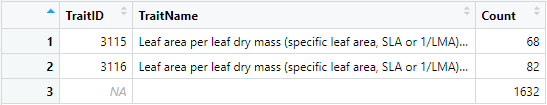{width="70%"}

With this, it is clear that the `TRYdata1` only includes data with two `TraitID` (3115 and 3116). And that within this dataset, there are 1632 ancillary data, i.e. the entries where `TraitID` is `NA`.

Next, further exploration of `TRYdata1` can be done based on the `AccSpeciesID`, `AccSpeciesName`, `TraitID` and `TraitName`.

```R
TRYdata1_explore_species <- rtry_explore(TRYdata1, AccSpeciesID, AccSpeciesName, TraitID, TraitName)
```

```R
## dim:   9 5
```

```R
View(TRYdata1_explore_species)
```

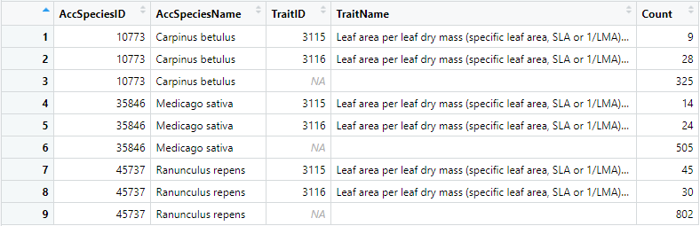{width="100%"}

The output is, by default, sorted by `AccSpeciesID`. The `TRYdata1` only contains three consolidated species (with `AccSpeciesID` equals 10773, 35846 and 45737). Each consolidated species has records where the `TraitID` equals 3115 and 3116, as well as the corresponding ancillary data.

After reassuring the data contains the necessary traits and species, for the purpose of preprocessing, it is also necessary to understand which ancillary data are provided within the dataset. To do so, explore the `TRYdata` based on `DataID`, `DataName`, `TraitID` and `TraitName`. This time, the exploration is sorted by `TraitID` to see if there are similar data in each trait.

```R
# Group the input data based on DataID, DataName, TraitID and TraitName
# and sort the output by TraitID using the sortBy argument
TRYdata1_explore_anc <- rtry_explore(TRYdata1, DataID, DataName, TraitID, TraitName, sortBy = TraitID)
```

```R
## dim:   156 5
```

```R
View(TRYdata1_explore_anc)
```

{width="100%"}

With this exploration and the way it is sorted, it is clear that in the `TRYdata1`: (1) there are two traits (`TraitID` 3115 and 3116); (2) within each trait, whether or not similar data exists (`DataID` and `DataName`); and (3) what types of ancillary data are provided (`DataID` and `DataName`, `TraitID`: `NA`) and how many (Count).

In the case of `TraitID` 3115, it can be seen that `DataID` 7222 and 7223 contain the extreme values (min or max) of the "Leaf specific area (SLA): petiole excluded". This information might be useful later on when further preprocessing is performed.

A similar procedure can be performed on the other TRY data (`TRYdata2`).

```R
# Group the input data based on TraitID and TraitName
TRYdata2_explore_trait <- rtry_explore(TRYdata2, TraitID, TraitName)

# Group the input data based on AccSpeciesID, AccSpeciesName, TraitID and TraitName
# Note: For TraitID == "NA", meaning that entry is an ancillary data
TRYdata2_explore_species <- rtry_explore(TRYdata2, AccSpeciesID, AccSpeciesName, TraitID, TraitName)

# Group the input data based on DataID, DataName, TraitID and TraitName
# Then sort the output by TraitID using the sortBy argument
TRYdata2_explore_anc <- rtry_explore(TRYdata2, DataID, DataName, TraitID, TraitName, sortBy = TraitID)
```

```R
## dim:   2 3
## dim:   6 5
## dim:   236 5
```

Then use either `head()` or `View()` function to view the data.

{width="100%"}

Via `View(TRYdata2_explore_anc)`, it can be seen that in the `TRYdata2`: (1) there is only one trait, with the `TraitID` equals to 3117; (2) within this trait, whether or not similar data exists; and (3) what types of ancillary data could be found and how many (Count).

Here, it is clear that `DataID` 6584 and 6598 share very similar `DataName`. This could mean that in the original dataset, two values of "SLA: undefined if petiole in- or excluded" were mapped to this trait, and the user might want to have this information in mind before further preprocessing.

<br>

# Bind imported data by rows

`rtry_bind_row()` takes two arguments `...` and `showOverview`. It takes a sequence of data and combines them by rows. Note: A common attribute is not necessary (difference to the function `rtry_join_left` and `rtry_join_outer`) and the binding process simply puts the data one after another while matching the column names, and any missing columns will be filled with `NA`.

With the two TRY data `TRYdata1` and `TRYdata2` already imported, it is possible to combine the two datasets into one (`TRYdata`):

```R
TRYdata <- rtry_bind_row(TRYdata1, TRYdata2)
```

```R
## dim:   6409 28
## col:   LastName FirstName DatasetID Dataset SpeciesName AccSpeciesID AccSpeciesName ObservationID ObsDataID TraitID TraitName DataID DataName OriglName OrigValueStr OrigUnitStr ValueKindName OrigUncertaintyStr UncertaintyName Replicates StdValue UnitName RelUncertaintyPercent OrigObsDataID ErrorRisk Reference Comment V28
```

From the dimension, it can be seen that now the two imported data have been combined together by rows, with `TRYdata1` on top then followed by `TRYdata2`, and a new data `TRYdata` has been created.

Now this combined data `TRYdata` can be explored using once again `rtry_explore()`.

```R
# Group the input data based on TraitID and TraitName
TRYdata_explore_trait <- rtry_explore(TRYdata, TraitID, TraitName)

# Group the input data based on AccSpeciesID, AccSpeciesName, TraitID and TraitName
# Note: For TraitID == "NA", meaning that entry is an ancillary data
TRYdata_explore_species <- rtry_explore(TRYdata, AccSpeciesID, AccSpeciesName, TraitID, TraitName)

# Group the input data based on DataID, DataName, TraitID and TraitName
# Then sort the output by TraitID using the sortBy argument
TRYdata_explore_anc <- rtry_explore(TRYdata, DataID, DataName, TraitID, TraitName, sortBy = TraitID)
```

```R
## dim:   4 3
## dim:   12 5
## dim:   331 5
```

To view the data, use either `head()` or `View()`.

<br>

# Select columns

Within the 'rtry' package, there are two ways to reduce the number of columns, i.e. either selecting the columns to keep: `rtry_select_col()` or explicitly removing certain columns: `rtry_remove_col()`.

Note: To ensure that the later preprocessing steps (such as data selection and duplicates removal) work properly, do not remove the column `ObservationID` and `OrigObsDataID`.

`rtry_select_col()` takes three arguments `input`, `...` and `showOverview` in order to select specified columns from the imported data.

`rtry_remove_col()` takes also three arguments `input`, `...` and `showOverview` to remove the specified columns from the input data instead.

It is up to the users to decide which function they prefer in retrieving the relevant columns of the data. In general, it would be easier to use the `rtry_remove_col()` when user would like to keep most of the columns and remove only a small fraction of the data column, such as `V28`.

```R
workdata <- rtry_remove_col(TRYdata, V28)
```

```R
## dim:   6409 27
## col:   LastName FirstName DatasetID Dataset SpeciesName AccSpeciesID AccSpeciesName ObservationID ObsDataID TraitID TraitName DataID DataName OriglName OrigValueStr OrigUnitStr ValueKindName OrigUncertaintyStr UncertaintyName Replicates StdValue UnitName RelUncertaintyPercent OrigObsDataID ErrorRisk Reference Comment
```

From the feedback in the console, it can be seen that only the column `V28` has been removed, therefore, the output `workdata` contains 27 columns, instead of the original 28. And users can continue removing columns if convenient.

On the other hand, if users are clear which columns they would like to keep, a more direct approach is, of course, the use of `rtry_select_col()`:

```R
workdata <- rtry_select_col(workdata, ObsDataID, ObservationID, AccSpeciesID, AccSpeciesName, ValueKindName, TraitID, TraitName, DataID, DataName, OriglName, OrigValueStr, OrigUnitStr, StdValue, UnitName, OrigObsDataID, ErrorRisk, Comment)
```

```R
## dim:   6409 17
## col:   ObsDataID ObservationID AccSpeciesID AccSpeciesName ValueKindName TraitID TraitName DataID DataName OriglName OrigValueStr OrigUnitStr StdValue UnitName OrigObsDataID ErrorRisk Comment
```

Here, from the feedback in the console, the users can confirm the remaining columns within the data (in this case the `workdata`), and continue to reduce the number of columns by selecting only the relevant columns.

<br>

# Select rows

`rtry_select_row()` takes five arguments `input`, `...`, `getAncillary`, `rmDuplicates` and `showOverview` to select specified rows based on the specified criteria from the imported data. Note that the argument `getAncillary` makes use of the `ObservationID` provided within the TRY data to select the whole observation including all corresponding ancillary data during the row extraction process.

For our example we will select all trait records, but only relevant ancillary data.

First, identify the relevant ancillary data using the `rtry_explore` function.

```R
workdata_explore_anc <- rtry_explore(workdata, DataID, DataName, TraitID, TraitName, sortBy = TraitID)
```

```R
## dim:   331 5
```

To view the data, use either `head()` or `View()`.

We retrieve six `DataID`s with trait records and 325 `DataID`s with ancillary information. For further data preprocessing, we decide to select the following `DataID`s that contain the relevant information:

-   59 Latitude
-   60 Longitude
-   61 Altitude
-   6601 Sampling date
-   327 Exposition
-   413 Plant developmental status / plant age / maturity / plant life stage
-   1961 Health status of plants (vitality)
-   113 Reference / source

To select all trait records and the ancillary data of interest:

```R
workdata <- rtry_select_row(workdata, TraitID > 0 | DataID %in% c(59, 60, 61, 6601, 327, 413, 1961, 113))
```

```R
## dim:   1017 17
```

To view the data, use either `head()` or `View()`.

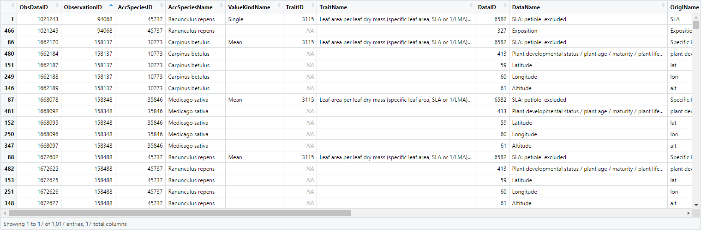{width="100%"}

{width="100%"}

In order to better understand the data, inside the data viewer (only available via RStudio), click on the column `ObservationID` to sort the dataset. This way, it can be seen that for example:

1.  For `ObservationID` 94068, there are two `ObsDataID` 1021243 and 1021245 with the first one belonging to the `TraitID` 3115 and the latter an ancillary data. Looking deeper into the `DataID` and `DataName`, we can see that this data "SLA: petiole excluded" is measured within "growth chambers", and could be eliminated later on depending on the research question.
2.  For `ObservationID` 158137, we can see there are four ancillary data with the `DataID` 59, 60, 61 and 413. Looking further into the `ErrorRisk` of the data "SLA: petiole excluded", which is roughly 2.5, meaning the observation is 2.5 standard deviation away from the mean. This is probably a "good" value that we would want to keep later. On top of this, it can be seen that the `OrigObsDataID` is `NA`, meaning that it is not a duplicate. Also, the "Plant developmental status" (`DataID` 413) could be an important information for further processing.

To check if the required data are selected, the `rtry_explore()` can be used:

```R
workdata_explore_anc <- rtry_explore(workdata, DataID, DataName, TraitID, TraitName, sortBy = TraitID)
```

```R
## dim:   14 5
```

Then use the command `View(workdata_explore_anc)` to view the output in the data viewer.

{width="100%"}

<br>

# Save and load backup data

It is recommended to backup the data at some stages of the preprocessing, best before excluding according to different attributes.

```R
# Save workdata_unexcluded as backup
workdata_unexcluded <- workdata
```

If necessary, load the backup data using the following:

```R
# Load workdata_unexcluded
workdata <- workdata_unexcluded
```

<br>

# Exclude (remove) data

The 'rtry' package provides the function `rtry_exclude` to exclude (remove) non-representative data.

`rtry_exclude()` takes four arguments `input`, `...`, `baseOn` and `showOverview` to exclude data from the input data based on the specified criteria.

The `rtry_exclude` function is designed to use the `baseOn` argument with either the column header `ObservationID` or `ObsDataID`. When the `baseOn` argument is set to `ObservationID`, the function removes all records of the whole observation if one selection criteria is fulfilled. If the `baseOn` argument is set to `ObsDataID`, only the (trait) record, which fulfills the selection criteria is removed. Other column headers may be used for the `baseOn` argument, but the result would need to be checked carefully.

The `rtry_exclude` function is very powerful and can be used on a range of different criteria. This function is therefore key for data cleaning. The workflow provides examples for the exclusion of whole observations using ancillary data (8.1 and 8.2), and the exclusion of single trait records according to additional trait specifications (8.3) and outliers (8.4 and 8.5).

<br>

## Exclude (remove) observations of juvenile plants or saplings

For demonstration purpose, we remove the data where the observed plant is juvenile or a sapling. We keep only observations on the mature or adult plants and the observations where information on the developmental state is explicitly unknown or is not provided (no `DataID` 413 for the given observation), assuming no information would rather follow the recommended measurement protocol - here measuring traits on mature plant.

First, identify the `DataID` that contains the information about plant development status, i.e. `413`. To check the different development status under the `OrigValueStr` column using the functions `rtry_select_row()` and `rtry_explore()`. The temporary data is saved as `tmp_unfiltered`.

```R
# Select the rows where DataID is 413, i.e. the data containing the plant development status
tmp_unfiltered <- rtry_select_row(workdata, DataID %in% 413)

# Then explore the unique values of the OrigValueStr within the selected data
tmp_unfiltered <- rtry_explore(tmp_unfiltered, DataID, DataName, OriglName, OrigValueStr, OrigUnitStr, StdValue, Comment, sortBy = OrigValueStr)
```

```R
## dim:   104 17
## dim:   7 8
```

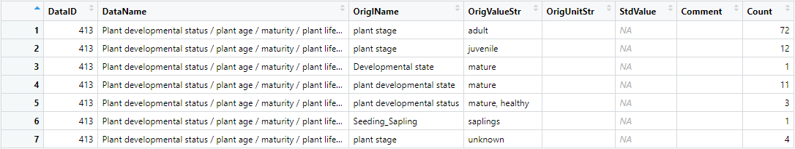{width="100%"}

By sorting the exploration by `OrigValueStr`, it is clear what types of developmental state exist in the dataset. This way it is possible to set the criteria and start the excluding process using `rtry_exclude()`.

In this case, to exclude the juvenile plants and saplings, we need to use the keywords "juvenile" and "saplings" when using the `rtry_exclude` function.

```R
# Criteria
# 1. DataID equals to 413
# 2. OrigValueStr equals to "juvenile" or "saplings"
workdata <- rtry_exclude(workdata, (DataID %in% 413) & (OrigValueStr %in% c("juvenile", "saplings")), baseOn = ObservationID)
```

```R
## dim:   957 17
```

Once the excluding is completed, double-check the `workdata` using the functions `rtry_select_row` and `rtry_explore`. The temporary data is saved as `tmp_filtered`.

```R
# Select the rows where DataID is 413, i.e. the data containing the plant development status
# Then explore the unique values of the OrigValueStr within the selected data
tmp_filtered <- rtry_select_row(workdata, DataID %in% 413)
tmp_filtered <- rtry_explore(tmp_filtered, DataID, DataName, OriglName, OrigValueStr, OrigUnitStr, StdValue, Comment, sortBy = OrigValueStr)
```

```R
## dim:   91 17
## dim:   5 8
```

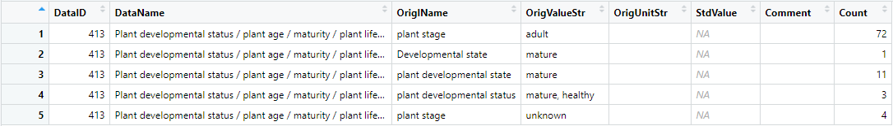{width="100%"}

From the exploration, it is clear that all the juvenile and sapling plants were excluded as expected.

To further confirm if the trait and/or other ancillary data of the deleted development states were also removed accordingly, use again the `rtry_explore` function.

```R
# Group the input data based on DataID, DataName, TraitID and TraitName
# Then sort the output by TraitID using the sortBy argument
workdata_explore_anc_excluded <- rtry_explore(workdata, DataID, DataName, TraitID, TraitName, sortBy = TraitID)
```

```R
## dim:   14 5
```

{width="100%"}

Compared with the `workdata_explore_anc`, it can be seen that the number of traits and ancillary data also decreased, which is as expected. We can see as well, that observations without a record for `DataID` 413 have not been removed by the exclude function, since it is assumed that these observations were measured according to the recommended measurement protocol (measuring traits on mature plants).

To also exclude the observations without information on plant development state as well, the user would first select only the observations, which include `DataID` 413, using the function `rtry_select_row` (please see the following example on geo-referenced data).

<br>

## Exclude observations without geo-referenced information and from irrelevant regions

To keep only the geo-referenced observations from a certain region for further processing, users can make use of the ancillary data "Latitude" (`DataID` 59) and "Longitude" (`DataID` 60). To ensure the excluding works as expected, it is best to perform the excluding process one after one. In this case, exclude according to latitude, then longitude.

**Filter according to latitude**

First, obtain only the observations that contain the Latitude (`DataID` 59) information, i.e. geo-referenced observations, using the function `rtry_select_row`.

```R
# Select only the geo-referenced observations, i.e. with DataID 59 Latitude
# Set getAncillary to TRUE to obtain (keep) all traits and ancillary data
workdata <- rtry_select_row(workdata, DataID %in% 59, getAncillary = TRUE)
```

```R
## dim:   717 17
```

Next, check the `DataID` that contains the latitude information, i.e. `59`, and check the different states of the `StdValue` using the functions `rtry_select_row` and `rtry_explore`.

```R
# Select the rows that contain DataID 59, i.e. latitude information
# Then explore the unique values of the StdValue within the selected data
tmp_unfiltered <- rtry_select_row(workdata, DataID %in% 59)
tmp_unfiltered <- rtry_explore(tmp_unfiltered, DataID, DataName, OriglName, OrigValueStr, OrigUnitStr, StdValue, Comment, sortBy = StdValue)
```

```R
## dim:   149 17
## dim:   55 8
```

For demonstration purpose, the following example excludes the latitude smaller than 40 or when such information is missing, i.e. `NA`.

```R
# Exclude observations using latitude information
# Criteria
# 1. DataID equals to 59
# 2. StdValue smaller than 40 or NA
workdata <- rtry_exclude(workdata, (DataID %in% 59) & (StdValue < 40 | is.na(StdValue)), baseOn = ObservationID)
```

```R
## dim:   624 17
```

Once the excluding is completed, double check the `workdata` using the functions `rtry_select_row` and `rtry_explore`.

```R
# Select the rows where DataID is 59 (Latitude)
# Then explore the unique values of the StdValue within the selected data
# Sort the exploration by StdValue
tmp_filtered <- rtry_select_row(workdata, DataID %in% 59)
tmp_filtered <- rtry_explore(tmp_filtered, DataID, DataName, OriglName, OrigValueStr, OrigUnitStr, StdValue, Comment, sortBy = StdValue)
```

```R
## dim:   131 17
## dim:   42 8
```

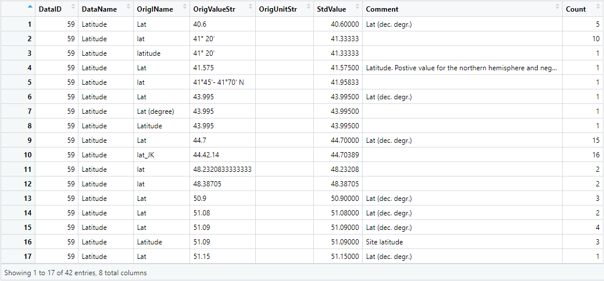{width="90%"}

From the exploration result, it is clear that only the latitude values larger than or equal to 40 remains.

**Filter according to longitude**

A similar procedure will be performed for longitude (`DataID` 60). To ensure the all the observations within the `workdata` contains the longitude information, use the `rtry_select_row` function.

```R
# Select only the geo-referenced observations with DataID 60 Longitude
# Set getAncillary to TRUE to obtain (keep) all traits and ancillary data
workdata <- rtry_select_row(workdata, DataID %in% 60, getAncillary = TRUE)
```

```R
## dim:   620 17
```

For demonstration purpose, this time we show how to remove the region of outside a certain range. The column `StdValue` will be used for the excluding process. To identify which values to be excluded, use the `rtry_select_row` and `rtry_explore` functions to explore the dataset.

```R
# Select the rows that contain DataID 60, i.e. longitude information
# Then explore the unique values of the StdValue within the selected data
tmp_unfiltered <- rtry_select_row(workdata, DataID %in% 60)
tmp_unfiltered <- rtry_explore(tmp_unfiltered, DataID, DataName, OriglName, OrigValueStr, OrigUnitStr, StdValue, Comment, sortBy = StdValue)
```

```R
## dim:   130 17
## dim:   41 8
```

After data exploration, use the following command to exclude the longitude smaller than 10 or larger than 60 or when such information is missing, i.e. `NA`.

```R
# Exclude observations using longitude information
# Criteria
# 1. DataID equals to 60
# 2. StdValue smaller than 10 or larger than 60 or NA
workdata <- rtry_exclude(workdata, (DataID %in% 60) & (StdValue < 10 | StdValue > 60 | is.na(StdValue)), baseOn = ObservationID)
```

```R
## dim:   227 17
```

Once the excluding is completed, double check the `workdata` using the functions `rtry_select_row` and `rtry_explore`.

```R
# Select the rows where DataID is 60 (Longitude)
# Then explore the unique values of the StdValue within the selected data
# Sort the exploration by StdValue
tmp_filtered <- rtry_select_row(workdata, DataID %in% 60)
tmp_filtered <- rtry_explore(tmp_filtered, DataID, DataName, OriglName, OrigValueStr, OrigUnitStr, StdValue, Comment, sortBy = StdValue)
```

```R
## dim:   47 17
## dim:   18 8
```

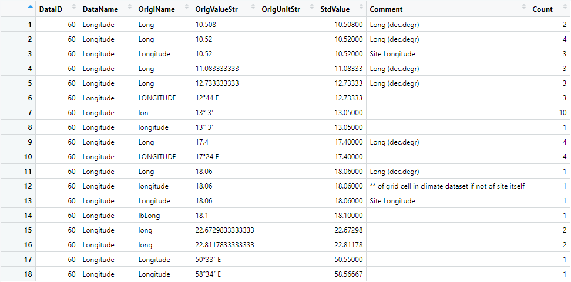{width="90%"}

From the exploration result, it is clear that only the latitude values in between 10 and 60 remain.

<br>

In the above examples the argument `baseOn` is set to `ObservationID`. This removes the whole observations. To select traits measured following standard measurement protocols and from specified environment we recommend to check at least the following `DataID`s:

-   59 Latitude
-   60 Longitude
-   61 Altitude
-   6601 Sampling date
-   327 Exposition
-   413 Plant developmental status / plant age / maturity / plant life stage
-   1961 Health status of plants (vitality)
-   113 Reference / source

<br>

## Exclude non-representative sub-traits

In this and the following examples, the argument `baseOn` is set to `ObsDataID`. These examples are supposed to exclude individual trait records or outliers, while keeping the rest of the observation, because the observation might contain records for other traits with relevant measurements.

In this context it might be of interest to remove non-representative sub-traits. This information can usually be found in the column `DataName`. In order to identify these data, explore the `workdata` based on `DataID`, `DataName`, `TraitID` and `TraitName`. Then sort the exploration by `TraitID`, this way it is possible to see if there are similar data in each trait. Note: This step has already been performed in the previous step, but for demonstration purpose and completeness of this example, the same function is called again.

```R
# Group the input data based on DataID, DataName, TraitID and TraitName
# Then sort the output by TraitID using the sortBy argument
tmp_unfiltered <- rtry_explore(workdata, DataID, DataName, TraitID, TraitName, sortBy = TraitID)
```

```R
## dim:   13 5
```

{width="100%"}

From this exploration, it can be seen that `DataID` 7222 and 7223 contains the minimum and maximum value of the "Leaf specific area (SLA: petiole excluded)" for trait 3115. Depending on the research question, the user might want to remove these observations. The same goes for `DataID` 6598 in trait 3117, where two values of "SLA: undefined if petiole in- or excluded" had been provided.

Now that the excluding criteria have been identified, the user might decide to only remove the trait records for `DataID` 7222, 7223 and 6598, while keeping the rest of the observation, because it might contain relevant records for other traits. In this case, use the `rtry_exclude` function with `baseOn` specified to `ObsDataID`:

```R
# Criteria
# 1. DataID equals to 7222, 7223 or 6598
workdata <- rtry_exclude(workdata, DataID %in% c(7222, 7223, 6598), baseOn = ObsDataID)
```

```R
## dim:   218 17
```

Double check the `workdata` using the functions `rtry_select_row` and `rtry_explore`.

```R
# Group the input data based on DataID, DataName, TraitID and TraitName
# Then sort the output by TraitID using the sortBy argument
tmp_filtered <- rtry_explore(workdata, DataID, DataName, TraitID, TraitName, sortBy = TraitID)
```

```R
## dim:   10 5
```

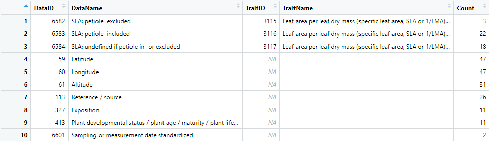{width="100%"}

It is clear that the defined `DataID`s have been removed, while the corresponding ancillary data are kept.

<br>

## Exclude data according to standard values (`StdValue`)

For demonstration purposes, we assume the user has decided that SLA (specific leaf area) values below 5 mm<sup>2</sup>mg<sup>-1</sup> are out of the relevant range for the purpose of the analyses.

Knowing that the SLA values can be found in `DataID` 6582, 6583 and 6584, first check if values below 5 exist in the dataset using the functions `rtry_select_row` and `rtry_explore`. The temporary data are saved as `tmp_unfiltered`. Note: To exclude numeric values, it is recommended to use the column `StdValue`.

```R
# Select the rows where DataID is 6582, 6583 and 6584, i.e. the data containing the SLA information
# Then explore the unique values of the StdValue within the selected data
tmp_unfiltered <- rtry_select_row(workdata, DataID %in% c(6582, 6583, 6584))
tmp_unfiltered <- rtry_explore(tmp_unfiltered, DataID, DataName, OriglName, OrigValueStr, OrigUnitStr, StdValue, UnitName, Comment, sortBy = StdValue)
```

```R
## dim:   43 17
## dim:   31 9
```

{width="100%"}

Here, it can be seen that there are three trait records with SLA value less than 5 mm<sup>2</sup>mg<sup>-1</sup>. To exclude these records, use the following command:

```R
# Criteria
# 1. DataID equals to 6582, 6583 or 6584
# 2. StdValue smaller than 5
workdata <- rtry_exclude(workdata, (DataID %in% c(6582, 6583, 6584)) & (StdValue < 5), baseOn = ObsDataID)
```

```R
## dim:   215 17
```

Once the excluding is completed, it is always recommended to double check the `workdata` using the functions `rtry_select_row` and `rtry_explore`.

```R
# Select the rows where DataID is 6582, 6583 and 6584, i.e. the data containing the SLA information
# Then explore the unique values of the StdValue within the selected data
tmp_filtered <- rtry_select_row(workdata, DataID %in% c(6582, 6583, 6584))
tmp_filtered <- rtry_explore(tmp_filtered, DataID, DataName, OriglName, OrigValueStr, OrigUnitStr, StdValue, UnitName, Comment, sortBy = StdValue)
```

```R
## dim:   40 17
## dim:   30 9
```

{width="100%"}

<br>

## Exclude outliers according to error risk (`ErrorRisk`)

The final example for the excluding process would be to remove the outliers identified in the context of TRY data integration. To do so, we take advantage of the column `ErrorRisk` provided inside the TRY output. The `ErrorRisk` quantifies the maximum distance of the trait record from a respective mean at the species, genus or family level in terms of standard deviation (a modified z-transformation). An `ErrorRisk` value of 3 indicates that the trait record is three standard deviations larger or smaller than the mean value based on species, genus or family (Kattge et al. [2011](https://doi.org/10.1111/j.1365-2486.2011.02451.x), [2020](https://doi.org/10.1111/gcb.14904)). We here filter the data with `ErrorRisk` larger than or equal to 3.0. With this in mind, the `rtry_explore` function is used to explore the data.

```R
# Group the input data based on DataID, DataName, TraitID, TraitName and ErrorRisk
# Then sort the output by ErrorRisk using the sortBy argument
tmp_unfiltered <- rtry_explore(workdata, DataID, DataName, TraitID, TraitName, ErrorRisk, sortBy = ErrorRisk)
```

```R
## dim:   34 6
```

{width="100%"}

From the exploration result, it can be seen that there are two outliers (with `ErrorRisk` larger than 3.0 in this case). It can also be observed that for those `ErrorRisk` equals NA, data may contain the geo-reference information and exposition of the observation. These are the values where `ErrorRisk` does not apply and should be kept.

After understanding what data to be excluded, use the `rtry_exclude` function to perform the data removal:

```R
# Criteria
# 1. ErrorRisk larger than or equal to 3
workdata <- rtry_exclude(workdata, ErrorRisk >= 3, baseOn = ObsDataID)
```

```R
## dim:   213 17
```

Always double check the excluded data before continuing the preprocessing.

```R
# Group the input data based on DataID, DataName, TraitID, TraitName and ErrorRisk
# Then sort the output by ErrorRisk using the sortBy argument
tmp_filtered <- rtry_explore(workdata, DataID, DataName, TraitID, TraitName, ErrorRisk, sortBy = ErrorRisk)
```

```R
## dim:   32 6
```

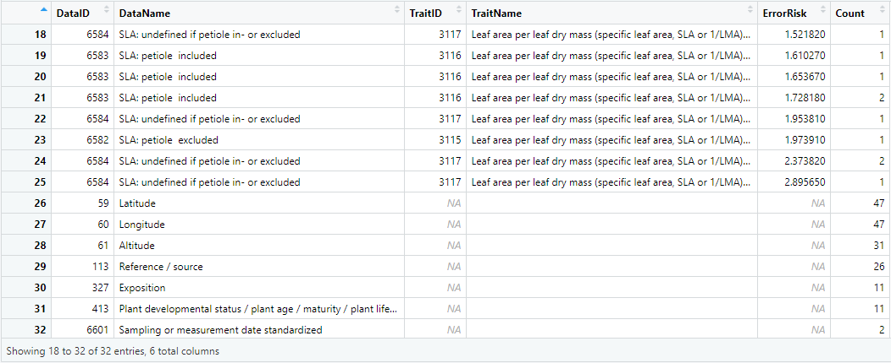{width="100%"}

From the exploration result, it can be seen that the outliers (i.e. `ErrorRisk` larger than or equal to 3.0) were removed.

<br>

# Remove duplicates based on duplicate identifier (`OrigObsDataID`)

As of July 2019, the TRY database comprised 588 data sets from 765 data contributors (Kattge et al. [2020](https://doi.org/10.1111/gcb.14904)). To keep track of potential duplicate entries, a unique identifier `OrigObsDataID` is assigned when the probability is high that certain trait records have previously been contributed (Kattge et al. [2020](https://doi.org/10.1111/gcb.14904)). With the help of this `OrigObsDataID`, the 'rtry' package provides a function `rtry_remove_dup` for users to easily remove the duplicates from the data for further processing.

`rtry_remove_dup()` takes two arguments `input` and `showOverview`, and returns a data table of the input data after removing the duplicates. Note: This function depends on the duplicate identifier `OrigObsDataID` listed in the TRY data, therefore, if the column `OrigObsDataID` has been removed, this function will not work. Also, if the original, not duplicate, trait record was not imported to 'rtry' (e.g. if only public data or specific datasets were requested from TRY and the original trait record was part of the restricted data or another dataset) the duplicates identified by TRY will still be removed, resulting in data loss.

To remove the duplicates from `workdata`, simply use the call the function:

```R
# Remove duplicates
workdata <- rtry_remove_dup(workdata)
```

```R
## 13 duplicates removed.
## dim:   200 17
```

Once the function is called and executed, by default the number of duplicates removed and the resulting dimension of the data will be displayed on the console as reference.

<br>

# Transform to wide table

For data management purposes, the TRY data is structured as a long-table, and this is what has been used so far. However, for human operators, it is often more common to read and understand a dataset in a wide-table format. Therefore, the 'rtry' package offers the function `rtry_trans_wider` for users to transform the long-table into a wide-table (i.e. increasing the number of columns and decreasing the number of rows) when needed. The `rtry_trans_wider` function represents the selected data-types (traits, ancillary data) as columns and every observation becomes one row.

`rtry_trans_wider()` takes five arguments `input`, `names_from`, `values_from`, `values_fn` and `showOverview` to transform the original long-table format of the TRY data into a wide-table format. Note: This function is based on the function `tidyr::pivot_wider`.

To ensure the long-table to wide-table transformation would not result in duplicate entries because of the potentially existence of multiple `ObservationID` for a single trait, the first step is to select only the traits with numerical values, and then the relevant columns will be selected.

```R
#-------------------------------------------------
# Exclude
# 1. All entries with "" in TraitID
# 2. Potential categorical traits that don't have a StdValue
# 3. Traits that have not yet been standardized in TRY
# Then select the relevant columns for transformation
# Note: The complete.cases() is used to ensure the cases are complete,
#       i.e. have no missing values
#-------------------------------------------------
num_traits <- rtry_select_row(workdata, complete.cases(TraitID) & complete.cases(StdValue))
num_traits <- rtry_select_col(num_traits, ObservationID, AccSpeciesID, AccSpeciesName, TraitID, TraitName, StdValue, UnitName)
```

```R
## dim:   25 17
## dim:   25 7
## col:   ObservationID AccSpeciesID AccSpeciesName TraitID TraitName StdValue UnitName
```

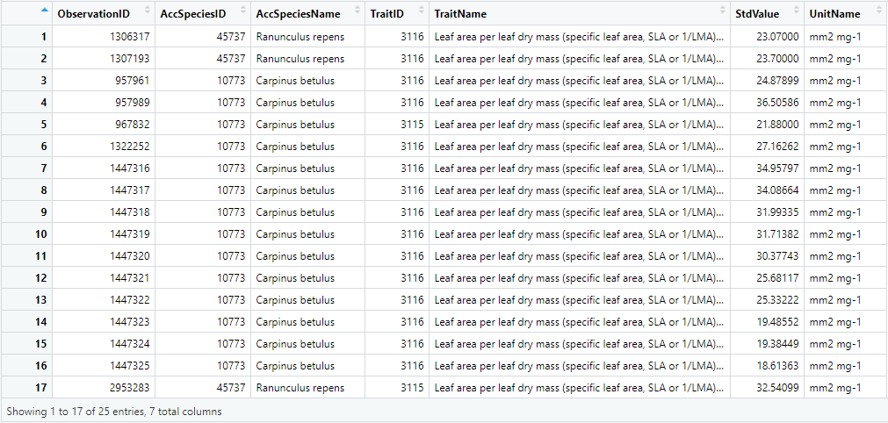{width="100%"}

Now that only the traits with numerical values were selected, in order to keep the ancillary data while transforming the data from long-table into wide-table on traits, the ancillary data needs to be added as additional columns before proceeding.

For demonstration purpose, the latitude and longitude information will be added to the input data to create a geo-referenced trait table before proceeding. To extract the unique values of the ancillary data and the corresponding `ObservationID`, use the `rtry_select_anc` function.

```R
# Extract the unique value of latitude (DataID 59) and longitude (DataID 60) together with the corresponding ObservationID
workdata_georef <- rtry_select_anc(workdata, 59, 60)
```

```R
## dim:   47 3
## col:   ObservationID Latitude Longitude
```

Next, add the extracted latitude and longitude information to the traits. To do so, make use of the `ObservationID` in both the trait records and the extracted ancillary data to merge the data frames. And in order to keep all the trait records, a left join should be used. This can be done using the `rtry_join_left` function provided in the 'rtry' package.

```R
# To merge the extracted ancillary data with the numerical traits
# Merge the relevant data frames based on the ObservationID using rtry_join_left (left join)
num_traits_georef <- rtry_join_left(num_traits, workdata_georef, baseOn = ObservationID)
```

```R
## dim:   25 9
## col:   ObservationID AccSpeciesID AccSpeciesName TraitID TraitName StdValue UnitName Latitude Longitude
```

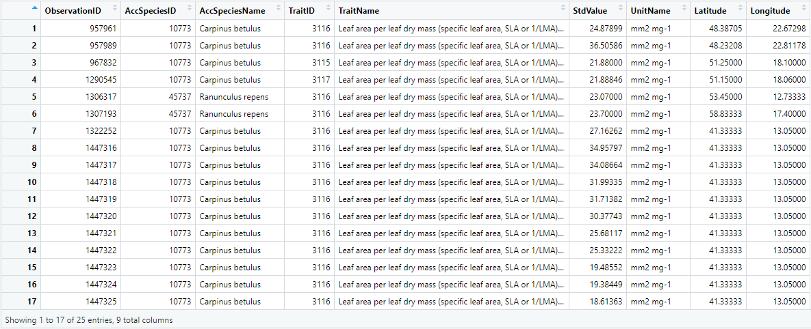{width="100%"}

It can be seen that the extracted latitude and longitude information were added to the right of the numerical traits.

Once the trait records and the necessary ancillary data were prepared, the transformation is performed on the `TraitID`, `TraitName` and `UnitName`, meaning to get the name of these three columns as part of the name of the output column (`names_from`), and then use the `StdValue` as the cell values (`values_from`). Also, the mean function is to be applied to each cell in the output (`values_fn`), e.g. if several trait records were measured within the same observation, because the `tidyr::pivot_wider` function accepts only one record per trait or ancillary data (column) and observation (row). To do so, use the following command:

```R
# Perform wide table transformation on TraitID, TraitName and UnitName
# With cell values to be the mean values calculated for StdValue
num_traits_georef_wider <- rtry_trans_wider(num_traits_georef, names_from = c(TraitID, TraitName, UnitName), values_from = c(StdValue), values_fn = list(StdValue = mean))
```

```R
## dim:   25 8
```

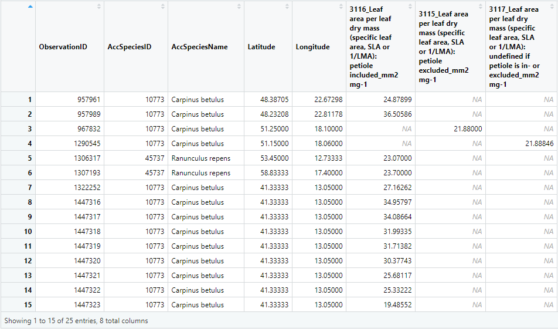{width="100%"}

Immediately, it can be seen that the columns `TraitID`, `TraitName` and `UnitName` were "transformed" into new columns, which were named for example "3115_Leaf area per leaf dry mass (specific leaf area, SLA or 1/LMA): petiole excluded_mm2 mg-1".

<br>

# Export preprocessed TRY data

The `rtry_export()` takes four arguments `data`, `output`, `quote` and `encoding` for users to export the preprocessed data as a CSV file. Note: If the specified output directory does not exist, it will be created automatically.

To save the two preprocessed wide tables `workdata_wider_traits` and `workdata_wider_data`, simply:

```R
# Export the data into a CSV file
output_file = file.path(tempdir(), "workdata_wider_traits.csv")
rtry_export(num_traits_georef_wider, output_file)
```

```R
## File saved at: C:/Users/user/AppData/Local/Temp/Rtmp4wJAvQ/workdata_wider_traits.csv
```
