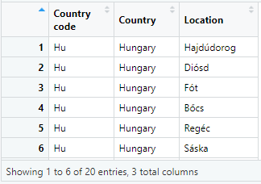
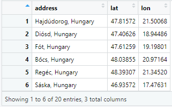
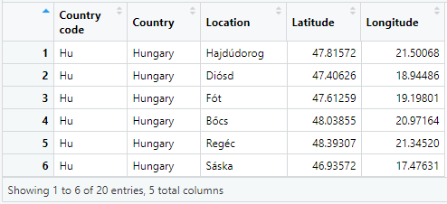
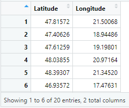
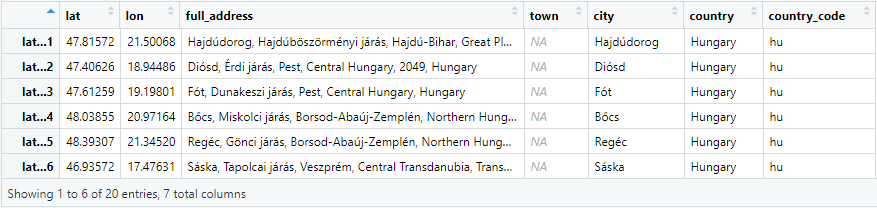
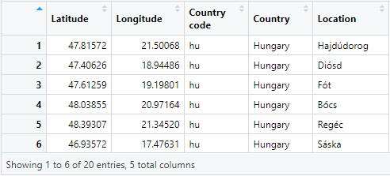

```{r, include = FALSE}
knitr::opts_chunk$set(
  collapse = TRUE,
  comment = "#>"
)
```

***

This vignette is intended to demonstrate how to use the functions `rtry_geocoding` and `rtry_revgeocoding` within the `rtry` package to perform geocoding and reverse geocoding for a list of locations or coordinates.

Geocoding is the process of converting an address into geographic coordinates (latitude and longitude), while reverse geocoding is the process of converting geographic coordinates (latitude and longitude) into an address.

The functions `rtry_geocoding` and `rtry_revgeocoding` are based on Nominatim, a search engine for OpenStreetMap (OSM) data. The data provided are free to use for any purpose, including commercial use, note that they are governed by the [Open Database License (ODbL)](https://wiki.osmfoundation.org/wiki/Licence). As part of the [Nominatim Usage Policy](https://operations.osmfoundation.org/policies/nominatim/), an absolute maximum of 1 request per second (no heavy usage) and a valid email address to identify the request are required when using this OSM service. For details, please refer to: https://wiki.openstreetmap.org/wiki/Nominatim.

Note that the georeference system used is WGS84 projection.

<br>

# Prepare the workflow environment

Make sure you have the `rtry` package installed. If not, you may refer to the vignette ["Introduction to rtry" (rtry-introduction)](rtry-introduction.html).

Apart from this vignette that comes along with the `rtry` package without additional download and acts as a guideline for users to follow, we also provide a corresponding R Markdown script (`.Rmd`) and a HTML file (`.html`), located inside the `examples` directory. The directory can be downloaded from the MPI-BGC Nextcloud, so that the users can run the example script (`.Rmd`) directly and compare the expected results (`.html`) in the browser.

Similarly, the sample data required to try out this example workflow are not only provided within the `rtry` package, but also inside the `examples/input` directory on the MPI-BGC Nextcloud. In order to follow the workflow smoothly, make sure the R script is placed inside the folder in which the sample data is saved inside the `input` folder. This can be done manually or achieved simply by downloading the entire `examples` directory from the Nextcloud.

- Link: https://nextcloud.bgc-jena.mpg.de/s/RMd5kqg7tRWXpae
- Password: `mpi-bgc-rtry`

To start, set the work directory to the location where the `examples` directory is located:

```R
# Set the working directory
setwd("<path_to_rtry_examples_dir>")

# Check the working directory
getwd()
```

Note: The character `\` is used as escape character in R to give the following character special meaning (e.g. `\n` for newline, `\t` for tab, `\r` for carriage return and so on). Therefore, for Windows users, it is important to replace the `\` in the file path with `/` in order for R to correctly understand the input path.


Load the required packages using the commands:

```R
# Load the rtry package
library(rtry)

# Check the version of rtry
packageVersion("rtry")

# Load the dplyr package which is used for piping (%>%)
library(dplyr)
```

<br>

# Use `rtry` for geocoding

The `rtry_geocoding()` takes two parameters `address` and `email`, and returns a data frame that contains latitude (`lat`) and longitude (`lon`) in WGS84 projection.

```R
rtry_geocoding(address = NULL, email = NULL)
```

| Argument  | Description                |
| --------- | -------------------------- |
| `address` | String of an address       |
| `email`   | String of an email address |

To load the `.csv` file with location information, use `rtry_import()`:

```R
# Load the locations from a .csv file
input_locations <- rtry_import("input/locations.csv", separator = ",", encoding = "UTF-8", quote = "\"")

# View the location data in the data viewer
View(input_locations)
```

```R
## input: input/locations.csv
## dim:   20 3
## col:   Country code Country Location
```

{width=40%}


Then, the location data should be converted into the required format for `address`, i.e. `<location>, <country>`:

```R
# Extract and combine the location and country names
input_addresses <- paste(input_locations$Location, input_locations$Country, sep = ", ")

# Display the first six rows
head(input_addresses)
```

```R
## [1] "Hajdúdorog, Hungary" "Diósd, Hungary"      "Fót, Hungary"        "Bőcs, Hungary"
## [5] "Regéc, Hungary"      "Sáska, Hungary"
```

Note that file encoding `UTF-8` is used, and it is normal for the RStudio console to display character in Unicode character (`<U+0000>` semantic) depending on the system language setting. For example, "Bőcs" might be displayed as "B<U+0151>cs".


In order to apply the function `rtry_geocoding()` to the list `input_addresses`, use `lapply()`, and please remember to change the email address into your own email address.

Since OSM is an absolute maximum of 1 request per second, in the following example, a 2 second delay has been set between each search.

```R
# Prepare counter for printed progress messages
counter <- 1
output_coordinates <- NULL # somethings received error messages 'no object found'

# Use lapply to apply function to the list of addresses
output_coordinates <- lapply(input_addresses, function(address) {
  # Calling the Nominatim OpenStreetMap API
  # Please change the email address into your own email address
  geocode_output <- rtry_geocoding(address, email = "john.doe@example.com")

  # No heavy uses (an absolute maximum of 1 request per second)
  # Here set to 2 seconds between each search
  Sys.sleep(2)

  # Print message in console to see the progress
  message("Geocoding ", counter, "/", nrow(input_locations), " completed.")
  counter <<- counter + 1

  # Return data.frame with the input address, output of the rtry_geocoding function
  return(data.frame(address = address, geocode_output))
}) %>%
  # Stack the list output into data.frame
  bind_rows() %>% data.frame()
```

```R
## Geocoding 1/20 completed.
## Geocoding 2/20 completed.
## Geocoding 3/20 completed.
## ...
## Geocoding 20/20 completed.
```

The progress of the geocoding can be seen in the console. Once the geocoding is completed, view the `output_coordinates` using the `View` function.

The `output_coordinates` would look like the following. Note that the location which is unknown to OSM, the resulting latitude and longitude will remain or marked as `NA`.

{width=40%}

Substitute the coordinates into the corresponding columns of the input data.

```R
# Add the output coordinates to the corresponding columns in the input data
input_locations$Latitude <- output_coordinates$lat
input_locations$Longitude <- output_coordinates$lon

# If necessary, re-arrange the columns
input_locations <- rtry_select_col(input_locations, "Country code", Country, Location, Latitude, Longitude, showOverview = FALSE)

# Export into .csv
rtry_export(input_locations, "output/locations_to_coordinates.csv")
```

{width=60%}

<br>

# Use `rtry` for reverse geocoding

The `rtry_revgeocoding()` takes two parameters `lat_lon` and `email`, and returns a data frame that contains the corresponding location.

```R
rtry_revgeocoding(lat_lon = NULL, email = NULL)
```

| Argument  | Description                                                  |
| --------- | ------------------------------------------------------------ |
| `lat_lon` | A data frame consisting latitude and longitude in WGS84 projection |
| `email`   | String of an email address                                   |

To load the `.csv` file with coordinates information, use `rtry_import()`:

```R
input_coordinates <- rtry_import("input/coordinates.csv", separator = ",", encoding = "UTF-8", quote = "\"")
```

```R
## input: input/coordinates.csv
## dim:   20 2
## col:   Latitude Longitude
```

{width=30%}

Then, the coordinates data should be converted into a `data.frame`:

```R
# Extract and converted the coordinates into a data frame
input_lat_lon <- data.frame(lat = input_coordinates$Latitude, lon = input_coordinates$Longitude)
```

In order to apply the function `rtry_revgeocoding` to the `input_lat_lon`, use `apply()`, and please remember to change the email address into your own email address.

Since OSM is an absolute maximum of 1 request per second, in the following example, a 2 second delay has been set between each search.

```R
# Prepare counter for printed progress messages
counter <- 1
output_locations <- NULL # somethings received error messages 'no object found'

# Use apply to apply function to the data.frame that contains the coordinates
# Please change the email address to your own email address
output_locations <- apply(input_lat_lon, 1, function(lat_lon) {
  # Calling the Nominatim OpenStreetMap API
  rev_geocode_output <- rtry_revgeocoding(lat_lon, email = "john.doe@example.com")

  # No heavy uses (an absolute maximum of 1 request per second)
  # Here set to 2 seconds between each search
  Sys.sleep(2)

  # Print message in console to see the progress
  message("Reverse Geocoding ", counter, "/", length(input_lat_lon$lat), " completed.")
  counter <<- counter + 1

  # Return data.frame with the input coordinates, output of the rtry_revgeocoding function
  return(data.frame(lat = lat_lon[1], lon = lat_lon[2], rev_geocode_output))
}) %>%
  # Stack the list output into data.frame
  bind_rows() %>% data.frame()
```

```R
## Reverse Geocoding 1/20 completed.
## Reverse Geocoding 2/20 completed.
## Reverse Geocoding 3/20 completed.
## ...
## Reverse Geocoding 20/20 completed.
```

The progress of the reverse geocoding can be seen in the console. Once the reverse geocoding is completed, view the `output_locations` using the `View` function.

The output location information would look like the following. Note that for some coordinates, OpenStreetMap might not have the town/city information, in such case, those columns will be marked as `NA`.

{width=100%}

Substitute the `country_code` and `country` into the corresponding columns of the input list, while the location information is extracted from either `town` or `city`.

```R
# Add the output location information to the corresponding columns in the input data
input_coordinates$'Country code' <- output_locations$country_code
input_coordinates$Country <- output_locations$country
input_coordinates$Location <- ifelse(!is.na(output_locations$town), output_locations$town, output_locations$city)

# If necessary, re-arrange the columns
input_coordinates <- rtry_select_col(input_coordinates, Latitude, Longitude, "Country code", Country, Location, showOverview = FALSE)

# Export into .csv
rtry_export(input_coordinates, "output/coordinates_to_locations.csv")
```

{width=60%}
